# SOFTWARE REQUIREMENTS SPECIFICATION (SRS) - ENTERPRISE LEVEL
## SYSTEM: SMART PARK - SMART AMUSEMENT PARK MANAGEMENT & BUSINESS INTELLIGENCE PLATFORM
### (Hệ thống Quản lý Khu vui chơi Thông minh tích hợp Business Intelligence)

---

# SECTION 1: SYSTEM INTRODUCTION & DOMAIN MODEL (GIỚI THIỆU & MÔ HÌNH MIỀN)

## 1.1. Document Purpose (Mục tiêu tài liệu)
Tài liệu Đặc tả Yêu cầu Phần mềm (SRS) này tuân thủ tiêu chuẩn IEEE 29148 nhằm định nghĩa toàn bộ thiết kế kiến trúc, mô hình nghiệp vụ, cấu trúc dữ liệu giao dịch (OLTP - MySQL), thiết kế kho dữ liệu đám mây (OLAP - Google BigQuery), các giao diện API RESTful (Spring Boot 3 & FastAPI) và 35 phân hệ nghiệp vụ của **Hệ thống Quản lý Khu vui chơi Thông minh tích hợp Business Intelligence (Smart Park)**.
Tài liệu này là cẩm nang thiết kế kỹ thuật duy nhất cho toàn bộ kỹ sư phát triển phần mềm, quản trị cơ sở dữ liệu, chuyên gia kỹ thuật dữ liệu (Data Engineers), kỹ sư trí tuệ nhân tạo (AI Engineers), đội ngũ vận hành hệ thống và Ban Giám đốc điều hành khu vui chơi.

## 1.2. Product Scope (Phạm vi hệ thống Smart Park)
Smart Park là một nền tảng quản trị tổng thể tài nguyên doanh nghiệp (ERP) kết hợp hệ thống phân tích báo cáo thông minh (BI) dành riêng cho các khu vui chơi giải trí phức hợp quy mô lớn (Amusement Parks, Water Parks, Safari). 
Trọng tâm thiết kế của Smart Park dựa trên các trục cốt lõi độc lập:
1. **Hệ thống Vận hành Trực tuyến (Operational OLTP Subsystem):** Quản lý quy trình phục vụ từ lúc khách hàng đến bãi xe, mua vé, qua cổng soát vé, sử dụng tủ đồ (Locker), chơi các trò chơi (Rides), ăn uống (Food Court), mua sắm (Retail) cho đến lúc phản hồi và rời bãi xe. Hệ thống được xây dựng trên nền tảng Spring Boot 3 kết hợp cơ sở dữ liệu MySQL và bộ nhớ đệm Redis.
2. **Đường truyền dữ liệu sự kiện (Event-Driven Data Pipeline):** Trích xuất toàn bộ thay đổi dữ liệu từ MySQL thông qua Debezium CDC đưa vào Apache Kafka Topics theo thời gian thực. Apache Spark tiêu thụ dữ liệu từ Kafka, thực hiện làm sạch, chuyển đổi và nạp vào Google BigQuery.
3. **Nền tảng Phân tích Thông minh (Analytical OLAP Subsystem):** Google BigQuery đóng vai trò là Kho dữ liệu đám mây trung tâm lưu trữ dữ liệu dưới dạng Star Schema, phục vụ trực tiếp cho Google Looker Studio để hiển thị 20 Dashboard BI trực quan hỗ trợ ra quyết định.
4. **Phân hệ Trí tuệ Nhân tạo (AI Inference Subsystem):** FastAPI đóng vai trò là microservice dự báo độc lập, thực hiện các dự báo vận hành qua REST API gọi bởi Spring Boot, không tham gia vào các thao tác lưu trữ nghiệp vụ CRUD.

## 1.3. Domain-Driven Design (DDD) & Domain Model Mapping
Hệ thống được thiết kế theo phương pháp hướng miền (Domain-Driven Design). Dưới đây là ma trận phân bổ các nghiệp vụ cốt lõi vào 20 Bounded Contexts (Miền nghiệp vụ):

```
+------------------------------------------------------------------------------------------+
|                                    SMART PARK PLATFORM                                   |
+------------------------------------------------------------------------------------------+
|  [Organization Domain]  --> Quản lý Phòng ban, Cơ cấu tổ chức, Chi nhánh công viên.       |
|  [Employee Domain]      --> Quản lý Nhân sự, Ca làm việc, Phân công tại cổng/trò chơi.   |
|  [Customer Domain]      --> Quản lý Hồ sơ khách hàng cá nhân, Phân khúc RFM.             |
|  [Park & Zone Domain]   --> Sơ đồ khu vui chơi, Quản lý phân khu địa lý độc lập.        |
|  [Ride Domain]          --> Danh mục trò chơi, Quản lý công suất hàng đợi, Trực thiết bị. |
|  [Maintenance Domain]   --> Bảo trì thiết bị trò chơi, Phiếu kiểm tra kỹ thuật định kỳ.  |
|  [Ticket Domain]        --> Quản lý loại vé, Quy tắc áp dụng, Định giá động.             |
|  [Booking & Order Dom]  --> Đặt vé trực tuyến, Thanh toán POS tại quầy, Hóa đơn VAT.      |
|  [Membership Domain]    --> Thẻ thành viên, Quy đổi điểm thưởng, Quản lý hạng VIP/Gold.   |
|  [Promotion Domain]     --> Chiến dịch khuyến mãi, Mã Coupon giảm giá theo đối tượng.    |
|  [Food & Beverage Dom]  --> Quầy ẩm thực, Thực đơn số, Gọi món trực tiếp qua POS.        |
|  [Retail Domain]        --> Quầy bán đồ lưu niệm, Quản lý kho hàng SKU, Bán lẻ tại shop. |
|  [Parking Domain]       --> Nhận diện biển số thông minh, Phí đỗ xe tự động.             |
|  [Locker Domain]        --> Cho thuê tủ đồ thông minh qua ứng dụng, khóa từ tự động.     |
|  [Incident Domain]      --> Tiếp nhận cảnh báo an ninh, Sự cố trò chơi, Cảnh báo y tế.   |
|  [Feedback Domain]      --> Đánh giá chất lượng dịch vụ, Giải quyết khiếu nại.           |
|  [Notification Domain]  --> Email, SMS, Web Push, Thông báo đẩy thiết bị cầm tay.         |
|  [Audit Domain]         --> Ghi nhật ký thao tác bất biến tầng database.                |
|  [BI & Analytics Dom]   --> CDC, Kafka Topics, Spark ETL, BigQuery DWH, Looker Studio.    |
+------------------------------------------------------------------------------------------+
```

---

# SECTION 2: SYSTEM ARCHITECTURE & DIAGRAMS (KIẾN TRÚC & SƠ ĐỒ)

## 2.1. Sơ đồ ngữ cảnh doanh nghiệp (Business Context Diagram)

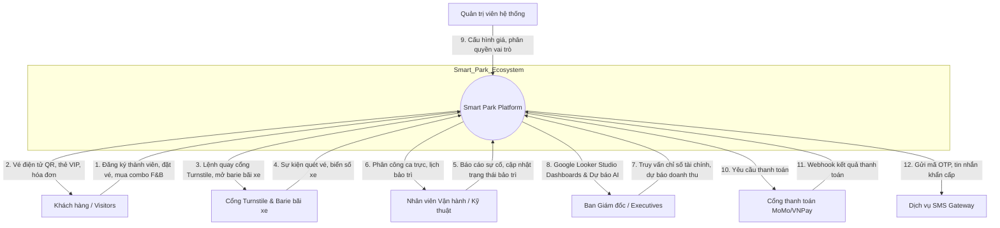

## 2.2. Sơ đồ ngữ cảnh hệ thống (System Context Diagram)

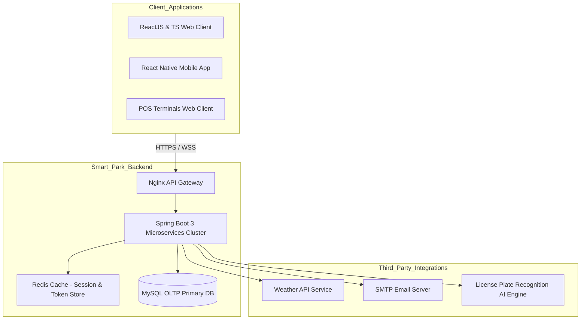

## 2.3. Sơ đồ Use Case tổng thể (Use Case Diagram)

```mermaid
flowchart TD
    actor Visitor as Khách tham quan
    actor Operator as Nhân viên vận hành
    actor Tech as Kỹ thuật viên bảo trì
    actor Exec as Giám đốc điều hành

    subgraph Guest_Services
        UC1(Đăng ký Membership)
        UC2(Đặt vé & F&B Combo)
        UC3(Thuê tủ Locker)
        UC4(Gửi phản hồi khiếu nại)
    end

    subgraph Park_Operations
        UC5(Quản lý lịch vận hành trò chơi)
        UC6(Kiểm soát đỗ xe thông minh)
        UC7(Bán hàng F&B & Quầy lưu niệm)
        UC8(Xử lý sự cố an ninh)
    end

    subgraph Maintenance_Services
        UC9(Kiểm tra kỹ thuật định kỳ)
        UC10(Sửa chữa & Thay thế thiết bị)
    end

    subgraph BI_Business_Intelligence
        UC11(Xem báo cáo doanh thu tài chính Looker Studio)
        UC12(Cấu hình giá vé động AI)
        UC13(Tra cứu dự báo lượng khách)
    end

    Visitor --> UC1 & UC2 & UC3 & UC4
    Operator --> UC5 & UC6 & UC7 & UC8
    Tech --> UC9 & UC10
    Exec --> UC11 & UC12 & UC13
```

## 2.4. Sơ đồ thành phần hệ thống (Component Diagram)

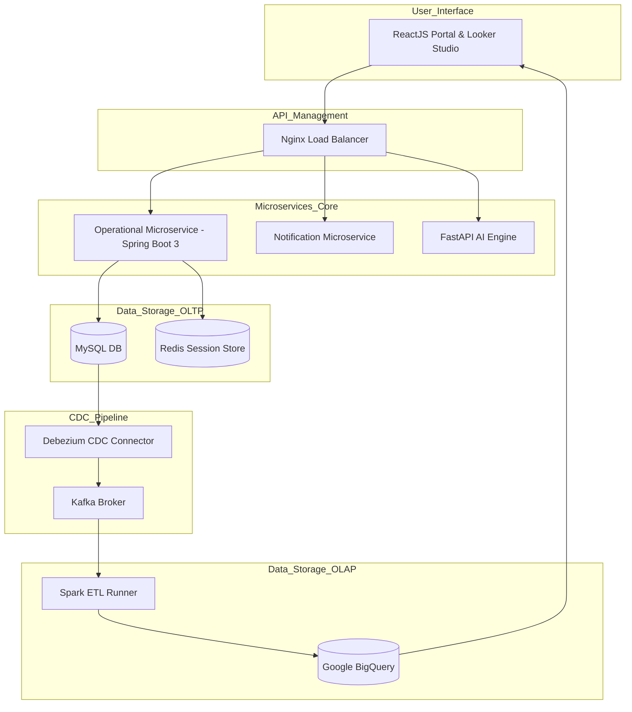

## 2.5. Sơ đồ triển khai vật lý (Deployment Diagram)

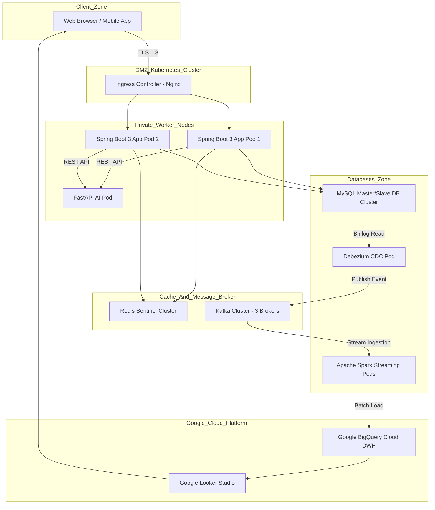

## 2.6. Sơ đồ cấu trúc Package (Package Diagram)

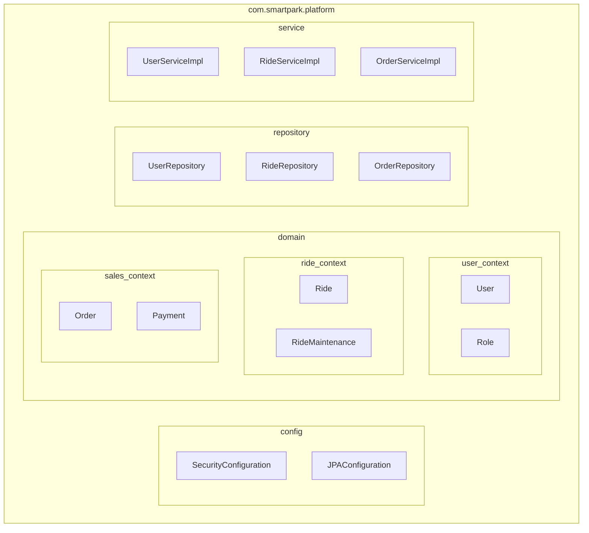

## 2.7. Sơ đồ tuần tự hành trình khách hàng (Sequence Diagram)

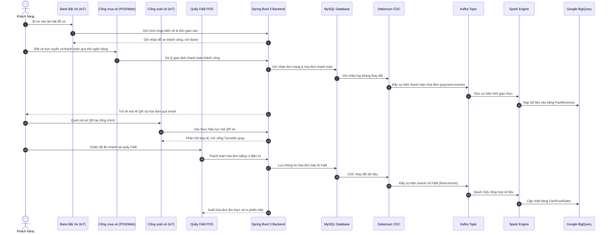

## 2.8. Sơ đồ hoạt động cấu hình giá vé động (Activity Diagram)

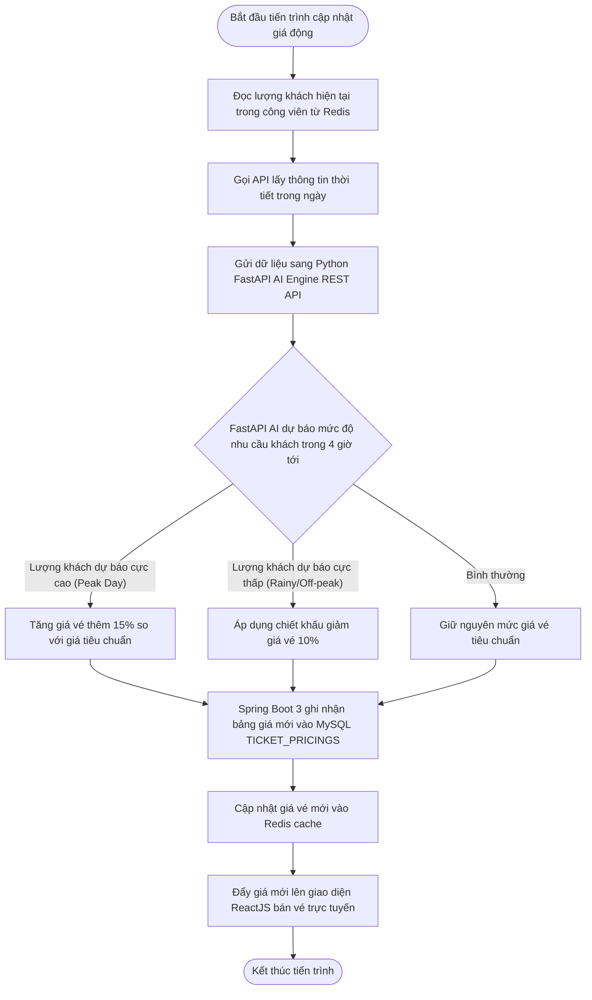

## 2.9. Sơ đồ trạng thái thiết bị trò chơi (State Diagram)

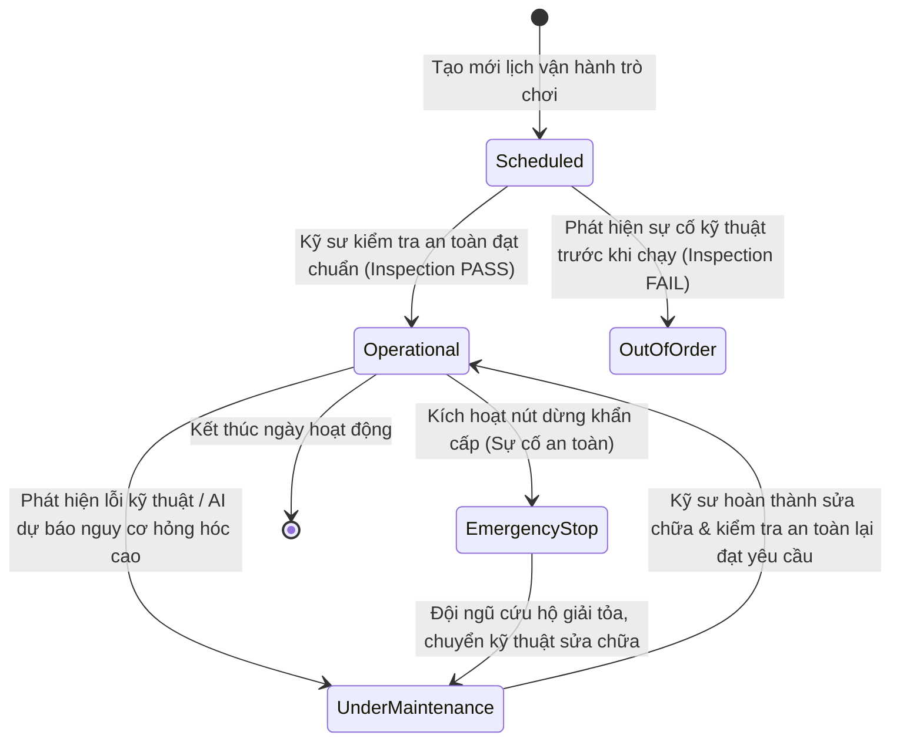

## 2.10. Sơ đồ lớp miền cốt lõi trò chơi & bảo trì (Class Diagram)

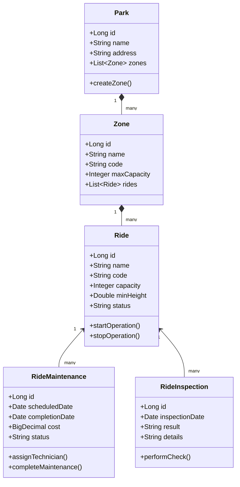

## 2.11. Kiến trúc phân tích dữ liệu (BI Pipeline Diagram)

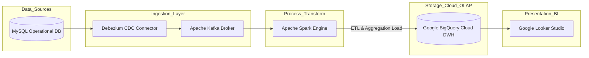

## 2.12. Sơ đồ dòng dữ liệu ETL (ETL Flow Diagram)

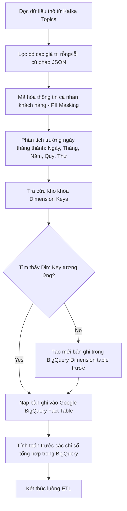

## 2.13. Sơ đồ dòng chảy dữ liệu phân tích (Analytics Flow Diagram)

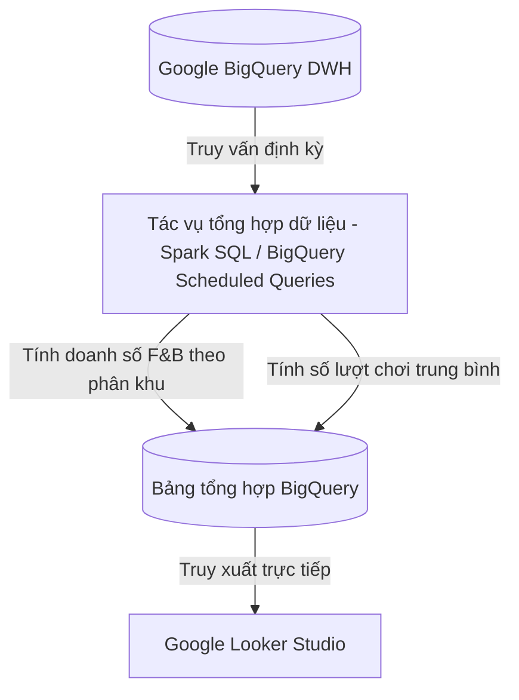

## 2.14. Quy trình xử lý Dashboard Giám đốc (Executive Dashboard Flow Diagram)

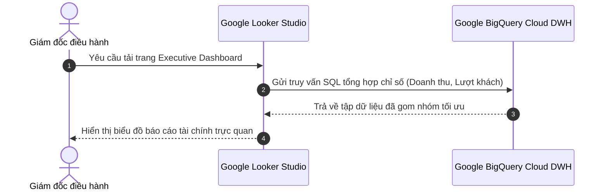

## 2.15. Sơ đồ kiến trúc Event Streaming (Event Streaming Architecture)

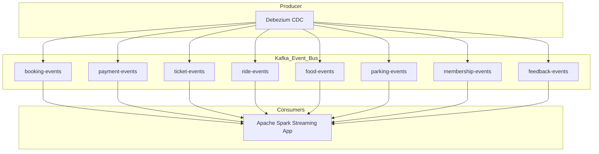

## 2.16. Sơ đồ kiến trúc AI (AI Architecture Diagram)

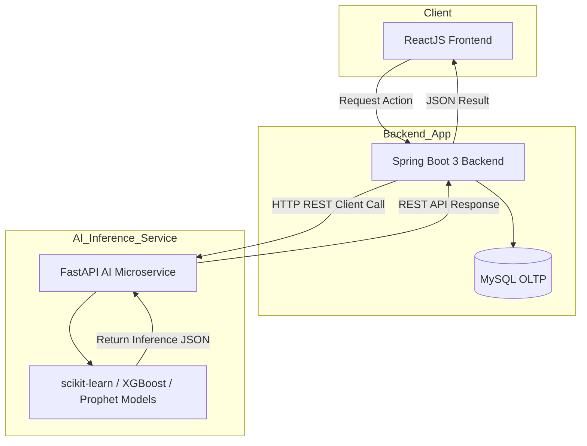

## 2.17. Sơ đồ công nghệ tổng thể (Technology Stack Diagram)

```
+-------------------------------------------------------------------------------+
| PRESENTATION LAYER: ReactJS, TypeScript, Material UI, Redux Toolkit, Axios    |
+-------------------------------------------------------------------------------+
| BUSINESS LAYER (CRUD): Spring Boot 3, Spring Security, JWT, Spring Data JPA   |
| SCHEDULING & DB MIGRATION: ShedLock (Redis/JDBC), Flyway Migration            |
+-------------------------------------------------------------------------------+
| OPERATIONAL DB: MySQL                   | CACHE: Redis                        |
+-------------------------------------------------------------------------------+
| CHANGE DATA CAPTURE: Debezium CDC                                             |
+-------------------------------------------------------------------------------+
| EVENT STREAMING: Apache Kafka                                                 |
+-------------------------------------------------------------------------------+
| DATA ENGINEERING: Apache Spark (Spark SQL, ETL, Data Aggregation)             |
+-------------------------------------------------------------------------------+
| CLOUD DATA WAREHOUSE: Google BigQuery                                         |
+-------------------------------------------------------------------------------+
| BUSINESS INTELLIGENCE: Google Looker Studio                                   |
+-------------------------------------------------------------------------------+
| AI INFERENCE MICROSERVICE: FastAPI (scikit-learn, Prophet, XGBoost)           |
+-------------------------------------------------------------------------------+
| DEPLOYMENT & CI/CD: Docker, Docker Compose, GitHub Actions, Docker Hub        |
+-------------------------------------------------------------------------------+
```

---

# SECTION 3: DETAILED FUNCTIONAL SPECIFICATIONS (ĐẶC TẢ CHI TIẾT CHỨC NĂNG - 35 MODULES)

## MIỀN 1: SECURITY & SYSTEM ADMINISTRATION (BẢO MẬT & QUẢN TRỊ HỆ THỐNG)

### MODULE 1: AUTHENTICATION (XÁC THỰC NGƯỜI DÙNG)
* **Objective:** Đảm bảo quyền truy cập an toàn cho toàn bộ nhân viên và khách hàng thông qua cơ chế JWT (JSON Web Token) kết hợp xác thực 2 yếu tố (2FA).
* **Business Rules:**
  * **BR-AUTH-01:** Mật khẩu lưu trữ trong bảng `users` bắt buộc phải được mã hóa một chiều bằng thuật toán `BCrypt` (Strength parameter = 12).
  * **BR-AUTH-02:** Sau 5 lần đăng nhập thất bại liên tiếp trong 10 phút, tài khoản bị khóa tạm thời trong 30 phút.
* **Use Case Flows:** Người dùng gửi thông tin đăng nhập -> Hệ thống đối chiếu -> Sinh cặp Access Token (JWT - hạn dùng 30 phút) và Refresh Token (hạn dùng 7 ngày).
* **Validation & Errors:** Trả về mã lỗi `ERR-AUTH-001` nếu thông tin đăng nhập sai lệch, `ERR-AUTH-002` nếu tài khoản đang trong trạng thái khóa.
* **Access Control:** Cho phép truy cập không định danh.
* **UI Description:** Giao diện đăng nhập hiện đại sử dụng Material UI, hỗ trợ đăng nhập bằng Google/Facebook OAuth2.
* **Database Mapping:** Bảng `users`.
* **API Endpoints:**
  * `POST /api/v1/auth/login` (Body: `{username, password}`)
  * `POST /api/v1/auth/mfa/verify` (Body: `{otpToken}`)

### MODULE 2: AUTHORIZATION (ỦY QUYỀN TRUY CẬP)
* **Objective:** Kiểm tra quyền hạn truy cập của người dùng tại API Gateway trước khi định tuyến luồng xử lý đến các microservices nghiệp vụ.
* **Business Rules:**
  * **BR-AUTHZ-01:** Phải phân tách rõ quyền kiểm tra dữ liệu nhạy cảm (như lương nhân viên, dữ liệu tài chính thô) khỏi quyền xem báo cáo Looker Studio.
* **Use Case Flows:** Người dùng gửi yêu cầu kèm JWT -> Gateway giải mã JWT lấy thông tin vai trò -> Đối chiếu bảng quyền -> Chấp nhận/Từ chối.
* **Validation & Errors:** Lỗi `ERR-AUTHZ-403` (Quyền truy cập bị từ chối) hiển thị khi vai trò người dùng không có quyền hạn tương thích.
* **Access Control:** Tự động áp dụng ở tầng lọc API Gateway.
* **Database Mapping:** Bảng `user_roles`, `role_permissions`.
* **API Endpoints:**
  * `GET /api/v1/authz/check-permission` (Headers: Authorization token)

### MODULE 3: ROLE & PERMISSION (VAI TRÒ & PHÂN QUYỀN)
* **Objective:** Cho phép System Admin cấu hình vai trò, gán danh sách các quyền tương ứng và áp dụng động vào hệ thống.
* **Business Rules:**
  * **BR-ROLE-01:** Không cho phép xóa các vai trò quản trị hệ thống cốt lõi (`SYSTEM_ADMIN`, `PARK_MANAGER`).
* **Use Case Flows:** Admin chọn một vai trò -> Tích chọn danh sách các quyền hạn trên ma trận phân quyền -> Lưu thông tin.
* **Validation & Errors:** Gửi yêu cầu xóa vai trò hệ thống trả về lỗi `ERR-ROLE-001`.
* **Access Control:** Chỉ dành riêng cho `System Admin`.
* **UI Description:** Giao diện lưới (Grid) hiển thị danh sách quyền và vai trò dạng checklist trực quan bằng Material UI.
* **Database Mapping:** Bảng `roles`, `permissions`, `role_permissions`.
* **API Endpoints:**
  * `POST /api/v1/admin/roles` (Body: `{name, description}`)
  * `PUT /api/v1/admin/roles/{id}/permissions` (Body: `[permissionIds]`)

### MODULE 4: USER MANAGEMENT (QUẢN LÝ TÀI KHOẢN)
* **Objective:** Tạo lập, cập nhật thông tin và quản trị trạng thái hoạt động của tài khoản người dùng trong hệ thống.
* **Business Rules:**
  * **BR-USER-01:** Không thực hiện xóa vật lý (Physical Delete) tài khoản người dùng, chỉ chuyển đổi trạng thái sang `DISABLED` để bảo toàn lịch sử giao dịch.
* **Use Case Flows:** Admin truy vấn tài khoản -> Thay đổi thông tin cá nhân hoặc chuyển trạng thái hoạt động tài khoản -> Lưu thay đổi.
* **Validation & Errors:** Địa chỉ email khi đăng ký mới không được trùng lặp với bất kỳ tài khoản nào đã tồn tại trong DB.
* **Access Control:** `System Admin`.
* **UI Description:** Giao diện quản trị dạng bảng có tính năng tìm kiếm, phân trang và lọc tài khoản theo trạng thái.
* **Database Mapping:** Bảng `users`.
* **API Endpoints:**
  * `GET /api/v1/admin/users` (Query: `page`, `size`, `status`)
  * `PUT /api/v1/admin/users/{id}/status` (Body: `{status}`)

---

## MIỀN 2: HUMAN RESOURCES & ORGANIZATIONAL DESIGN (NHÂN SỰ & PHÒNG BAN)

### MODULE 5: CUSTOMER MANAGEMENT (QUẢN LÝ KHÁCH HÀNG)
* **Objective:** Lưu trữ hồ sơ, lịch sử giao dịch, lịch sử tham quan và phân loại hành vi tiêu dùng của khách hàng.
* **Business Rules:**
  * **BR-CUST-01:** Toàn bộ thông tin định danh cá nhân (PII) như Email, Số điện thoại phải được che giấu một phần (masking) trên màn hình hiển thị của nhân viên không có thẩm quyền.
* **Use Case Flows:** Nhân viên CSKH tra cứu thông tin khách hàng qua số điện thoại để hỗ trợ đổi vé hoặc nâng hạng thành viên.
* **Validation & Errors:** Số điện thoại nhập vào bắt buộc có độ dài 10 chữ số, bắt đầu bằng chữ số 0.
* **Access Control:** `Park Manager`, `Operations Staff`.
* **UI Description:** Giao diện hồ sơ khách hàng dạng thẻ (Profile Card) hiển thị thông tin cơ bản, lịch sử mua vé và số điểm tích lũy thành viên sử dụng Material UI.
* **Database Mapping:** Bảng `customers`.
* **API Endpoints:**
  * `GET /api/v1/customers` (Query: `phone`, `email`)
  * `PUT /api/v1/customers/{id}` (Body: `{fullName, phone, address}`)

### MODULE 6: EMPLOYEE MANAGEMENT (QUẢN LÝ NHÂN VIÊN)
* **Objective:** Quản lý thông tin hồ sơ nhân sự, chức vụ, mức lương, và lịch làm việc của nhân viên tại khu vui chơi.
* **Business Rules:**
  * **BR-EMP-01:** Nhân viên mới bắt buộc phải được gắn trực tiếp vào một phòng ban (Department) đang hoạt động.
* **Use Case Flows:** Nhân viên nhân sự nhập thông tin nhân viên mới -> Hệ thống tự động tạo tài khoản đăng nhập tương thích và gửi email kích hoạt.
* **Validation & Errors:** Trùng mã nhân viên (Employee Code) trả về mã lỗi `ERR-EMP-001`.
* **Access Control:** `System Admin`, `Park Manager`.
* **UI Description:** Giao diện danh sách nhân sự hỗ trợ bộ lọc nhanh theo phòng ban, trạng thái làm việc và thanh tìm kiếm nhanh.
* **Database Mapping:** Bảng `employees`.
* **API Endpoints:**
  * `POST /api/v1/employees` (Body: `{fullName, email, salary, departmentId}`)
  * `GET /api/v1/employees/{id}`

### MODULE 7: DEPARTMENT MANAGEMENT (QUẢN LÝ PHÒNG BAN)
* **Objective:** Thiết lập cơ cấu tổ chức quản lý trong khu vui chơi, định nghĩa danh sách phòng ban và chỉ định trưởng bộ phận quản lý.
* **Business Rules:**
  * **BR-DEPT-01:** Mỗi phòng ban tại một thời điểm chỉ có duy nhất một Trưởng bộ phận (Manager ID).
* **Use Case Flows:** Admin tạo phòng ban mới -> Chọn nhân sự làm quản lý phòng ban -> Lưu thông tin cấu trúc tổ chức.
* **Validation & Errors:** Không được phép xóa phòng ban nếu phòng ban đó đang chứa nhân sự hoạt động.
* **Access Control:** `System Admin`.
* **UI Description:** Sơ đồ tổ chức dạng cây phân cấp (Organizational Tree View) dễ sử dụng bằng thư viện Material UI Tree.
* **Database Mapping:** Bảng `departments`.
* **API Endpoints:**
  * `POST /api/v1/departments` (Body: `{name, code, managerId}`)
  * `GET /api/v1/departments`

---

## MIỀN 3: PARK & ATTRACTION MANAGEMENT (QUẢN LÝ KHU VUI CHƠI & PHÂN KHU)

### MODULE 8: PARK MANAGEMENT (QUẢN LÝ CÔNG VIÊN)
* **Objective:** Cấu hình và quản lý thông tin các công viên thành viên trong chuỗi dự án giải trí (ví dụ: Công viên nước, Công viên chủ đề).
* **Business Rules:**
  * **BR-PARK-01:** Mỗi công viên phải được định nghĩa thời gian mở cửa, đóng cửa và sức chứa an toàn tối đa.
* **Use Case Flows:** Ban giám đốc thay đổi giờ mở cửa của công viên chủ đề -> Hệ thống cập nhật lên cổng thông tin trực tuyến và đồng bộ tới hệ thống soát vé.
* **Validation & Errors:** Sức chứa tối đa của công viên phải lớn hơn tổng sức chứa thiết kế của toàn bộ các phân khu (Zones) bên trong cộng lại.
* **Access Control:** `System Admin`.
* **UI Description:** Dashboard quản lý danh sách công viên thành viên dạng thẻ lưới kèm hình ảnh đại diện và trạng thái hoạt động thực tế.
* **Database Mapping:** Bảng `parks`.
* **API Endpoints:**
  * `POST /api/v1/parks` (Body: `{name, code, maxCapacity, openTime, closeTime}`)
  * `PUT /api/v1/parks/{id}`

### MODULE 9: ZONE MANAGEMENT (QUẢN LÝ PHÂN KHU)
* **Objective:** Chia nhỏ công viên thành các khu vực địa lý chức năng để dễ dàng theo dõi mật độ khách hàng và hiệu năng trò chơi.
* **Business Rules:**
  * **BR-ZONE-01:** Một phân khu bắt buộc phải trực thuộc một công viên cụ thể.
* **Use Case Flows:** Quản lý cấu hình sức chứa tối đa của phân khu trò chơi cảm giác mạnh -> Hệ thống áp dụng để cảnh báo mật độ khách trên Dashboard.
* **Access Control:** `Park Manager`.
* **Database Mapping:** Bảng `zones`.
* **API Endpoints:**
  * `POST /api/v1/parks/{parkId}/zones` (Body: `{name, code, maxCapacity}`)
  * `GET /api/v1/zones` (Query: `parkId`)

---

## MIỀN 4: RIDE OPERATIONS & SAFETY (VẬN HÀNH TRÒ CHƠI & AN TOÀN)

### MODULE 10: RIDE MANAGEMENT (QUẢN LÝ TRÒ CHƠI)
* **Objective:** Quản lý danh mục trò chơi, thông số giới hạn an toàn (chiều cao, cân nặng) và trạng thái sẵn sàng của trò chơi.
* **Business Rules:**
  * **BR-RIDE-01:** Trò chơi chỉ được vận hành khi trạng thái an toàn được kiểm tra thông qua Module Ride Inspection đầu ngày.
* **Use Case Flows:** Nhân viên vận hành trò chơi cập nhật trạng thái trò chơi khi bắt đầu mở cửa hoặc đóng cửa tạm thời.
* **Validation & Errors:** Giới hạn chiều cao tối thiểu (`min_height`) phải là số dương lớn hơn 0 và không vượt quá 250 cm.
* **Access Control:** `Park Manager`, `Operations Staff`.
* **UI Description:** Thẻ thông tin trò chơi hiển thị trực quan thông số an toàn, công suất và trạng thái hoạt động (Màu xanh: Đang chạy, Đỏ: Bảo trì).
* **Database Mapping:** Bảng `rides`.
* **API Endpoints:**
  * `GET /api/v1/rides` (Query: `zoneId`, `status`)
  * `PUT /api/v1/rides/{id}/status` (Body: `{status}`)

### MODULE 11: RIDE CATEGORY MANAGEMENT (QUẢN LÝ DANH MỤC TRÒ CHƠI)
* **Objective:** Phân loại các trò chơi theo nhóm (Cảm giác mạnh, Gia đình, Trẻ em, Trình diễn nghệ thuật) để hỗ trợ phân tích hành vi và báo cáo.
* **Database Mapping:** Bảng `ride_categories`.
* **API Endpoints:**
  * `POST /api/v1/ride-categories` (Body: `{name, description}`)

### MODULE 12: RIDE SCHEDULE (LỊCH TRÌNH VẬN HÀNH)
* **Objective:** Phân công nhân sự trực và lên lịch khung giờ hoạt động của từng trò chơi trong ngày.
* **Business Rules:**
  * **BR-SCHED-01:** Nhân viên được phân công vận hành trò chơi phải có chứng chỉ kỹ thuật tương thích với loại trò chơi đó.
* **Use Case Flows:** Quản lý lên lịch trực ca cho nhân viên tại trò chơi tàu lượn siêu tốc -> Hệ thống kiểm tra điều kiện an toàn và chứng chỉ nhân sự -> Xác nhận lưu lịch trực.
* **Database Mapping:** Bảng `ride_schedules`.
* **API Endpoints:**
  * `POST /api/v1/rides/{rideId}/schedules` (Body: `{employeeId, shiftDate, startTime, endTime}`)

### MODULE 13: RIDE CAPACITY (QUẢN LÝ SỨC CHỨA & HÀNG ĐỢI)
* **Objective:** Theo dõi số lượng khách đang xếp hàng chờ và tỷ lệ lấp đầy của từng lượt chơi thực tế.
* **Business Rules:**
  * **BR-CAP-01:** Khi số lượng khách xếp hàng thực tế vượt quá 150% sức chứa thiết kế của khu vực hàng đợi, hệ thống phải phát tín hiệu cảnh báo ùn tắc.
* **Database Mapping:** Bảng `ride_capacities`.
* **API Endpoints:**
  * `GET /api/v1/rides/{rideId}/capacity-status` -> Trả về số lượng khách đang xếp hàng và công suất lượt chơi hiện tại.

### MODULE 14: RIDE MAINTENANCE (BẢO TRÌ TRÒ CHƠI)
* **Objective:** Quản lý lịch bảo trì định kỳ, đột xuất, theo dõi chi phí sửa chữa và linh kiện thay thế của từng trò chơi.
* **Business Rules:**
  * **BR-MAINT-01:** Trò chơi có phiếu bảo trì chưa hoàn thành (trạng thái `IN_PROGRESS`) bắt buộc phải bị khóa quyền soát vé check-in tại cổng trò chơi.
* **Use Case Flows:** Kỹ sư hoàn tất sửa chữa thiết bị -> Nhập mô tả linh kiện thay thế và chi phí thực tế -> Ký xác nhận đóng phiếu bảo trì.
* **Validation & Errors:** Chi phí bảo trì không được nhỏ hơn 0.
* **Access Control:** `Maintenance Tech`, `Park Manager`.
* **UI Description:** Biểu đồ Kanban quản trị tiến trình bảo trì (Lên lịch, Đang sửa, Chờ kiểm tra, Hoàn thành).
* **Database Mapping:** Bảng `ride_maintenances`.
* **API Endpoints:**
  * `POST /api/v1/maintenance/tickets` (Body: `{rideId, description, scheduledDate}`)
  * `PUT /api/v1/maintenance/tickets/{id}/complete` (Body: `{cost, notes}`)

### MODULE 15: RIDE INSPECTION (KIỂM TRA AN TOÀN TRÒ CHƠI)
* **Objective:** Ghi nhận kết quả kiểm tra kỹ thuật an toàn bắt buộc trước khi mở cửa đón khách hằng ngày của từng trò chơi.
* **Business Rules:**
  * **BR-INSP-01:** Báo cáo kiểm tra an toàn phải được nộp trước 07:30 sáng hằng ngày. Nếu không có báo cáo kiểm tra đạt yêu cầu (`PASS`), trò chơi sẽ không được mở trạng thái hoạt động trên cổng thông tin.
* **Database Mapping:** Bảng `ride_inspections`.
* **API Endpoints:**
  * `POST /api/v1/inspections` (Body: `{rideId, inspectorId, result, details}`)

---

## MIỀN 5: TICKETING, BOOKING & ORDERS (VÉ & ĐƠN HÀNG)

### MODULE 16: TICKET MANAGEMENT (QUẢN LÝ VÉ)
* **Objective:** Định nghĩa các loại vé (Vé thường, Vé VIP, Vé gia đình, Vé năm) và quản lý vòng đời vé điện tử QR Code.
* **Business Rules:**
  * **BR-TKT-01:** Mỗi mã vé QR Code được sinh ra phải là duy nhất, mã hóa bằng thuật toán AES-256 để tránh làm giả.
* **Use Case Flows:** Khách quét vé QR tại cổng chính -> Hệ thống ghi nhận trạng thái từ `UNUSED` sang `USED`.
* **Database Mapping:** Bảng `tickets`, `ticket_types`.
* **API Endpoints:**
  * `GET /api/v1/tickets/{code}` -> Kiểm tra thông tin vé.

### MODULE 17: TICKET PRICING (CẤU HÌNH GIÁ VÉ & GIÁ ĐỘNG)
* **Objective:** Cấu hình bảng giá vé tiêu chuẩn và gọi FastAPI AI Engine dự báo để cập nhật giá vé động.
* **Business Rules:**
  * **BR-PRICE-01:** Biên độ điều chỉnh giá vé động của AI không được vượt quá khoảng giới hạn tối thiểu (`min_price`) và tối đa (`max_price`) do Admin thiết lập tĩnh cho từng loại vé trong Spring Boot.
* **Use Case Flows:** Spring Boot gửi HTTP request sang FastAPI để lấy giá vé đề xuất -> Cập nhật bảng giá trong MySQL -> Đồng bộ lên giao diện ReactJS.
* **Database Mapping:** Bảng `ticket_pricings`.
* **API Endpoints:**
  * `POST /api/v1/ticket-types/{id}/prices/dynamic` -> Spring Boot gọi FastAPI và cập nhật giá vé động.

### MODULE 18: BOOKING (ĐẶT VÉ TRỰC TUYẾN)
* **Objective:** Cung cấp giao diện đặt vé trực tuyến cho khách hàng sử dụng ReactJS và Axios, cho phép chọn ngày đi, loại vé, số lượng và dịch vụ gia tăng.
* **Business Rules:**
  * **BR-BOOK-01:** Hệ thống giữ chỗ vé đặt mua trong vòng tối đa 15 phút. Nếu không nhận được xác nhận thanh toán thành công, đặt chỗ tự động bị hủy.
* **Database Mapping:** Bảng `bookings`.
* **API Endpoints:**
  * `POST /api/v1/bookings` (Body: `{customerName, email, date, ticketTypeId, quantity}`)

### MODULE 19: ORDER MANAGEMENT (QUẢN LÝ ĐƠN HÀNG)
* **Objective:** Quản lý tập trung toàn bộ các đơn hàng đặt vé, đơn hàng ẩm thực F&B, mua sắm đồ lưu niệm trong công viên.
* **Business Rules:**
  * **BR-ORD-01:** Mọi thay đổi dữ liệu đơn hàng thành công trong MySQL được Debezium CDC bắt lại và đẩy tự động sang Kafka topic `order-events` theo mô hình Event-Driven.
* **Database Mapping:** Bảng `orders`, `order_items`.
* **API Endpoints:**
  * `GET /api/v1/orders/{orderCode}`

### MODULE 20: PAYMENT (THANH TOÁN)
* **Objective:** Tích hợp với các cổng thanh toán số (VNPay, MoMo) để hoàn tất giao dịch tự động của khách hàng.
* **Business Rules:**
  * **BR-PAY-01:** Mọi phản hồi Webhook từ cổng thanh toán phải được kiểm tra chữ ký bảo mật checksum trước khi cập nhật trạng thái hóa đơn thành công.
* **Database Mapping:** Bảng `payments`, `payment_methods`.
* **API Endpoints:**
  * `POST /api/v1/payments/webhook/vnpay`

---

## MIỀN 6: GUEST SERVICES & LOYALTY (DỊCH VỤ KHÁCH HÀNG & THÀNH VIÊN)

### MODULE 21: MEMBERSHIP (THÀNH VIÊN & TÍCH ĐIỂM)
* **Objective:** Quản lý hạng thẻ VIP, tích lũy điểm thưởng khi chi tiêu và quy đổi điểm thưởng sang mã giảm giá.
* **Business Rules:**
  * **BR-MEM-01:** Hạng thành viên được cập nhật tức thời khi tổng chi tiêu tích lũy vượt ngưỡng quy định của hạng thẻ cao hơn.
* **Database Mapping:** Bảng `memberships`, `membership_tiers`.
* **API Endpoints:**
  * `GET /api/v1/memberships/{code}`

### MODULE 22: PROMOTION (CHƯƠNG TRÌNH KHUYẾN MÃI)
* **Objective:** Thiết kế chiến dịch marketing, giảm giá trực tiếp theo khung giờ hoặc đối tượng khách hàng cụ thể.
* **Database Mapping:** Bảng `promotions`.
* **API Endpoints:**
  * `POST /api/v1/promotions` (Body: `{name, discountType, value, startDate, endDate}`)

### MODULE 23: COUPON (MÃ GIẢM GIÁ)
* **Objective:** Phát hành mã coupon áp dụng giảm giá trực tiếp trên tổng giá trị đơn hàng đặt mua trực tuyến hoặc tại quầy.
* **Database Mapping:** Bảng `coupons`.
* **API Endpoints:**
  * `POST /api/v1/coupons` (Body: `{code, promotionId, maxUses}`)

### MODULE 24: FOOD COURT MANAGEMENT (QUẢN LÝ KHU ẨM THỰC)
* **Objective:** Quản lý menu món ăn, sơ đồ quầy ẩm thực (Food Stalls) và xử lý gọi món qua hệ thống POS di động.
* **Business Rules:**
  * **BR-FC-01:** Các giao dịch mua bán đồ ăn tại khu ẩm thực phải lưu trữ mã quầy hàng để phục vụ Spark phân tích dữ liệu DWH.
* **Database Mapping:** Bảng `food_courts`, `food_stalls`, `food_items`.
* **API Endpoints:**
  * `GET /api/v1/food-courts/{id}/stalls`
  * `POST /api/v1/food-courts/orders` (Body: `{stallId, items: [{itemId, quantity}]}`)

### MODULE 25: RETAIL SHOP MANAGEMENT (QUẢN LÝ CỬA HÀNG BÁN LẺ)
* **Objective:** Quản lý hàng tồn kho đồ lưu niệm, mã vạch sản phẩm (SKU) và xử lý quét mã vạch thanh toán tại quầy thu ngân cửa hàng.
* **Database Mapping:** Bảng `retail_shops`, `retail_items`.
* **API Endpoints:**
  * `GET /api/v1/retail/items`
  * `POST /api/v1/retail/transactions` (Body: `{shopId, items: [{sku, quantity}]}`)

### MODULE 26: PARKING MANAGEMENT (QUẢN LÝ BÃI ĐỖ XE THÔNG MINH)
* **Objective:** Kết nối camera LPR tự động mở barie khi xe vào/ra, tính phí gửi xe dựa trên loại phương tiện.
* **Business Rules:**
  * **BR-PARK-01:** Hệ thống phải lưu trữ ảnh chụp biển số xe và trả về tín hiệu mở barie trong vòng dưới 1 giây sau khi xe dừng tại vạch quét.
* **Database Mapping:** Bảng `parking_lots`, `parking_transactions`.
* **API Endpoints:**
  * `POST /api/v1/parking/gate/entry` (Body: `{plateNumber, rawImage}`)
  * `POST /api/v1/parking/gate/exit` (Body: `{plateNumber}`)

### MODULE 27: LOCKER MANAGEMENT (QUẢN LÝ TỦ ĐỒ THÔNG MINH)
* **Objective:** Hỗ trợ khách hàng thuê tủ đồ thông minh lưu trữ hành lý cá nhân thông qua mã QR được cấp trên thiết bị di động.
* **Database Mapping:** Bảng `lockers`, `locker_transactions`.
* **API Endpoints:**
  * `POST /api/v1/lockers/rent` (Body: `{lockerId, customerId, durationHours}`)

---

## MIỀN 7: FEEDBACK, NOTIFICATION & INCIDENTS (PHẢN HỒI, THÔNG BÁO & SỰ CỐ)

### MODULE 28: FEEDBACK MANAGEMENT (QUẢN LÝ PHẢN HỒI KHIẾU NẠI)
* **Objective:** Tiếp nhận ý kiến đóng góp, đánh giá chất lượng dịch vụ của khách hàng để gửi cho bộ phận CSKH xử lý.
* **Database Mapping:** Bảng `feedbacks`.
* **API Endpoints:**
  * `POST /api/v1/feedbacks` (Body: `{customerId, rating, content}`)

### MODULE 29: NOTIFICATION MANAGEMENT (QUẢN LÝ THÔNG BÁO)
* **Objective:** Gửi thông báo tự động (OTP, hóa đơn, cảnh báo bảo trì khẩn cấp) qua Email, SMS và Firebase Push.
* **Database Mapping:** Bảng `notifications`.
* **API Endpoints:**
  * `POST /api/v1/notifications/send` (Body: `{userId, title, content, type}`)

### MODULE 30: INCIDENT MANAGEMENT (QUẢN LÝ SỰ CỐ AN NINH VÀ AN TOÀN)
* **Objective:** Ghi nhận khẩn cấp các sự cố xảy ra tại khu vui chơi (Tai nạn, trộm cắp, lỗi kỹ thuật trò chơi đột xuất) để điều động đội phản ứng nhanh.
* **Business Rules:**
  * **BR-INC-01:** Cảnh báo mức độ nghiêm trọng `CRITICAL` phải tự động kích hoạt còi báo động tại phòng điều khiển và gửi SMS đến toàn bộ ban quản lý công viên.
* **Database Mapping:** Bảng `incidents`.
* **API Endpoints:**
  * `POST /api/v1/incidents` (Body: `{zoneId, severity, description}`)

### MODULE 31: AUDIT LOG (NHẬT KÝ HỆ THỐNG BẤT BIẾN)
* **Objective:** Lưu vết toàn bộ các hành động thêm, sửa, xóa dữ liệu trên MySQL phục vụ công tác thanh tra kiểm toán bảo mật.
* **Business Rules:**
  * **BR-AUD-01:** Bảng dữ liệu log audit chỉ được phép ghi dữ liệu, không cấp quyền sửa hoặc xóa bản ghi log cho bất kỳ vai trò nào ở tầng cơ sở dữ liệu.
* **Database Mapping:** Bảng `audit_logs`.
* **API Endpoints:**
  * `GET /api/v1/admin/audit-logs` (Query: `startDate`, `endDate`, `userId`)

---

## MIỀN 8: BUSINESS INTELLIGENCE & ANALYTICS (TRÍ TUỆ KINH DOANH & PHÂN TÍCH DOANH NGHIỆP)

### MODULE 32: BUSINESS INTELLIGENCE (HỆ THỐNG BI & PIPELINE)
* **Objective:** Định cấu hình hệ thống đường ống ETL Debezium CDC -> Kafka -> Spark để nạp dữ liệu thô từ MySQL đẩy vào Google BigQuery DWH.
* **Business Rules:**
  * **BR-BI-01:** Quá trình đồng bộ dữ liệu giao dịch sang BigQuery phải đạt tính toàn vẹn 100%, không được mất mát dữ liệu tài chính trong quá trình trích xuất và nạp.
  * **BR-BI-02:** Áp dụng cơ chế Dead Letter Queue (DLQ) cho Analytics Outbox, các sự kiện quá 3 lần retry sẽ bị đẩy vào bảng Dead Letter để Admin quản lý và requeue.
* **Database Mapping:** Toàn bộ cấu trúc Star Schema BigQuery, bảng `analytics_events` và `analytics_dead_letter` trên MySQL.
* **API Endpoints:**
  * `GET /api/v1/bi/pipeline-status` -> Trả về tình trạng hoạt động của luồng Spark Streaming & Kafka.
  * `GET /api/v1/admin/dlq` -> Truy vấn danh sách sự kiện gửi thất bại.
  * `POST /api/v1/admin/dlq/{id}/requeue` -> Đẩy sự kiện trở lại hàng chờ.

### MODULE 33: ANALYTICS (PHÂN TÍCH CHỈ SỐ DOANH NGHIỆP)
* **Objective:** Thiết lập các tác vụ định kỳ của Spark SQL tính toán chỉ số hiệu suất doanh nghiệp (KPIs) và lưu trữ trong BigQuery.
* **API Endpoints:**
  * `GET /api/v1/analytics/kpi/revenue-summary`

### MODULE 34: FORECASTING (DỰ BÁO XU HƯỚNG AI)
* **Objective:** Spring Boot gọi REST API của FastAPI AI Service để nhận kết quả phân tích dự báo lượng khách và doanh thu tuần tới dựa trên mô hình học máy.
* **API Endpoints:**
  * `GET /api/v1/ai/forecast/visitors` -> Spring Boot gọi FastAPI `POST /forecast/visitor` và trả về kết quả dự báo cho ReactJS.

### MODULE 35: EXECUTIVE DASHBOARD (BẢNG ĐIỀU KHIỂN TỔNG GIÁM ĐỐC)
* **Objective:** Giao diện Google Looker Studio truy vấn dữ liệu từ BigQuery, trực quan hóa chỉ số tài chính, vận hành thời gian thực để Ban Giám đốc quản lý toàn bộ hệ thống Smart Park.
* **UI Description:** Looker Studio Dashboards được tích hợp trực tiếp (Embedded iframe) vào giao diện ReactJS.
* **API Endpoints:**
  * `GET /api/v1/bi/dashboards/looker-share-url`

---

# SECTION 4: BUSINESS INTELLIGENCE PLATFORM & DASHBOARDS (LOOKER STUDIO & BIGQUERY)

Nền tảng phân tích thông minh được xây dựng trên kho dữ liệu đám mây Google BigQuery (OLAP DWH) kết nối trực tiếp với Google Looker Studio để cung cấp 12 Dashboard phân tích chuyên sâu sau:

### 4.1. Executive Dashboard (Dashboard Tổng Giám Đốc)
* **KPIs:** Tổng doanh thu (Doanh thu vé + F&B + Retail + Gửi xe), tổng lượt khách tham quan, chỉ số hài lòng khách hàng (CSAT), hiệu suất vận hành trò chơi trung bình.
* **Visualizations:** Biểu đồ đường xu hướng doanh thu tích lũy tháng, bản đồ nhiệt mật độ khách hàng hiện tại trong công viên.

### 4.2. Financial Dashboard (Dashboard Tài Chính)
* **KPIs:** Lợi nhuận trước thuế (EBITDA), Biên lợi nhuận gộp, Dòng tiền tự do, Tỷ lệ chi phí vận hành trên tổng doanh thu.
* **Visualizations:** Biểu đồ miền thể hiện biến động chi phí và doanh thu theo quý, bảng đối soát dòng tiền.

### 4.3. Revenue Dashboard (Dashboard Doanh Thu)
* **KPIs:** Doanh thu gộp hằng ngày, Doanh số trung bình trên mỗi khách hàng (ARPU), Doanh số F&B lũy kế.
* **Visualizations:** Biểu đồ tròn cơ cấu doanh thu từ các nguồn dịch vụ khác nhau trong công viên.

### 4.4. Profit Dashboard (Dashboard Lợi Nhuận)
* **KPIs:** Lợi nhuận ròng, Lợi nhuận từ hoạt động F&B, Lợi nhuận từ hoạt động bán lẻ đồ lưu niệm.
* **Visualizations:** Biểu đồ cột chồng biểu diễn lợi nhuận của từng chi nhánh công viên thành viên.

### 4.5. Customer Dashboard (Dashboard Khách Hàng)
* **KPIs:** Số lượt đăng ký tài khoản khách hàng mới, cơ cấu phân nhóm độ tuổi khách hàng, tỷ lệ khách hàng quay lại.
* **Visualizations:** Biểu đồ Scatter Plot phân nhóm khách hàng theo mô hình RFM (Recency, Frequency, Monetary).

### 4.6. Membership Dashboard (Dashboard Thành Viên)
* **KPIs:** Tổng số thẻ VIP đang hoạt động, tỷ lệ nâng hạng thành viên, điểm thưởng quy đổi tích lũy.
* **Visualizations:** Biểu đồ cột chồng số lượng thành viên phân loại theo thứ hạng Gold, Silver, Platinum.

### 4.7. Ride Performance Dashboard (Dashboard Hiệu Suất Trò Chơi)
* **KPIs:** Tổng số lượt chạy của các trò chơi trong ngày, tỷ lệ hoạt động đúng giờ của lịch trình.
* **Visualizations:** Biểu đồ cột ngang xếp hạng Top 10 trò chơi chạy nhiều lượt nhất.

### 4.8. Ride Utilization Dashboard (Dashboard Tỷ Lệ Sử Dụng Trò Chơi)
* **KPIs:** Tỷ lệ lấp đầy ghế ngồi trung bình mỗi lượt chạy, số lượt khách chơi trên 1 giờ của từng trò chơi.
* **Visualizations:** Biểu đồ đường thể hiện xu hướng sử dụng trò chơi theo các khung giờ trong ngày.

### 4.9. Ride Downtime Dashboard (Dashboard Thời Gian Ngưng Hoạt Động Trò Chơi)
* **KPIs:** Tổng số giờ ngưng hoạt động do lỗi (Downtime), tỷ lệ hỏng hóc kỹ thuật trung bình của trò chơi.
* **Visualizations:** Biểu đồ cột biểu thị thời gian dừng chạy do lỗi kỹ thuật của từng trò chơi.

### 4.10. Maintenance Dashboard (Dashboard Bảo Trì Thiết Bị)
* **KPIs:** Tổng chi phí bảo trì tích lũy, thời gian trung bình để sửa chữa xong một lỗi kỹ thuật (MTTR), số lượng linh kiện đã thay thế.
* **Visualizations:** Biểu đồ đường chi phí bảo trì biến động qua các tháng.

### 4.11. Employee Dashboard (Dashboard Nhân Sự)
* **KPIs:** Tỷ lệ hoàn thành công việc của nhân viên, số ca trực bị trống nhân sự, đánh giá chất lượng phục vụ của nhân viên tại quầy.
* **Visualizations:** Bảng xếp hạng năng suất của nhân viên soát vé và nhân viên quầy POS.

### 4.12. Department Dashboard (Dashboard Phòng Ban)
* **KPIs:** Chi phí vận hành của từng phòng ban, tổng số nhân sự hoạt động trong phòng ban.
* **Visualizations:** Sơ đồ tổ chức phân bổ ngân sách vận hành của các bộ phận chức năng.

### 4.13. Promotion Dashboard (Dashboard Chiến Dịch Ưu Đãi)
* **KPIs:** Doanh thu tăng trưởng do chương trình ưu đãi mang lại, tỷ lệ khách hàng áp dụng mã giảm giá.
* **Visualizations:** Biểu đồ cột so sánh doanh thu các chiến dịch khuyến mãi.

### 4.14. Peak Hour Dashboard (Dashboard Khung Giờ Cao Điểm)
* **KPIs:** Khung giờ có lượng khách check-in đông nhất, thời gian tắc nghẽn trung bình tại bãi đỗ xe và cổng chính.
* **Visualizations:** Biểu đồ nhiệt (Heatmap Grid) biểu thị lượng khách theo giờ và ngày trong tuần.

### 4.15. Visitor Flow Dashboard (Dashboard Dòng Chảy Khách Tham Quan)
* **KPIs:** Tốc độ di chuyển của khách từ cổng chính vào các phân khu trò chơi, lượng khách ra/vào mỗi phân khu.
* **Visualizations:** Sơ đồ dòng chảy Sankey (Sankey Diagram) mô tả luồng di chuyển thực tế của khách hàng.

### 4.16. Zone Heatmap Dashboard (Dashboard Bản Đồ Nhiệt Phân Khu)
* **KPIs:** Số lượng khách hiện tại có trong từng phân khu, mức độ quá tải so với sức chứa tối đa.
* **Visualizations:** Bản đồ địa lý công viên (Park Map Visual) có các vùng màu chuyển sắc tương ứng với mật độ khách thực tế.

### 4.17. Food Sales Dashboard (Dashboard Doanh Số Ẩm Thực F&B)
* **KPIs:** Tổng doanh số khu ẩm thực, Top món ăn bán chạy nhất, doanh thu trung bình của từng quầy ẩm thực.
* **Visualizations:** Biểu đồ tròn cơ cấu doanh thu món ăn và đồ uống.

### 4.18. Retail Sales Dashboard (Dashboard Doanh Số Bán Lẻ)
* **KPIs:** Doanh thu quầy quà lưu niệm, tốc độ luân chuyển hàng tồn kho SKU, số lượng hàng hóa bán ra.
* **Visualizations:** Biểu đồ cột ngang thể hiện doanh thu của 10 sản phẩm lưu niệm bán chạy nhất.

### 4.19. Parking Dashboard (Dashboard Bãi Đỗ Xe)
* **KPIs:** Tỷ lệ trống chỗ bãi đỗ xe, doanh thu dịch vụ đỗ xe, tỷ lệ phân bổ phương tiện xe máy và ô tô.
* **Visualizations:** Biểu đồ tròn biểu thị tỷ lệ lấp đầy chỗ đỗ xe thời gian thực.

### 4.20. Forecast Dashboard (Dashboard Dự Báo Vận Hành & Tài Chính)
* **KPIs:** Dự báo tổng doanh thu tháng tới, dự báo lượng khách tham quan trong ngày lễ kỷ niệm tiếp theo.
* **Visualizations:** Biểu đồ đường nét đứt dự báo (Confidence interval bands) thể hiện kết quả dự đoán của AI.

---

# SECTION 5: ENTERPRISE AI ENGINE (FASTAPI MICROSERVICE)

Hệ thống tích hợp Python FastAPI AI Microservice chạy độc lập, giao tiếp với Spring Boot 3 qua HTTP REST APIs để cung cấp kết quả dự báo (Inference Only). Không thực hiện thao tác CRUD dữ liệu.

1. **Visitor Forecast (Dự báo lượng khách):** 
   * **Endpoint:** `POST /forecast/visitor` (Body: `{startDate, endDate}`) -> Trả về danh sách dự báo số lượng khách hằng ngày sử dụng mô hình Prophet.
2. **Revenue Forecast (Dự báo doanh thu):** 
   * **Endpoint:** `POST /forecast/revenue` (Body: `{monthsAhead}`) -> Trả về doanh thu dự báo sử dụng XGBoost.
3. **Ride Demand Prediction (Dự đoán nhu cầu trò chơi):** 
   * **Endpoint:** `POST /forecast/ride-demand` (Body: `{rideId, targetDate}`) -> Dự báo số lượng lượt khách xếp hàng tại trò chơi theo giờ.
4. **Maintenance Prediction (Dự báo bảo trì thiết bị):** 
   * **Endpoint:** `POST /forecast/maintenance-prediction` (Body: `{rideId, runCycles, wearScore}`) -> Dự đoán rủi ro hỏng hóc cơ học.
5. **Customer Segmentation (Phân cụm khách hàng):** 
   * **Endpoint:** `POST /customer-segmentation` (Body: `{rfmScoreMatrix}`) -> Trả về phân nhóm cụm khách hàng VIP/vãng lai sử dụng scikit-learn K-Means.
6. **Recommendation Engine (Gợi ý dịch vụ):** 
   * **Endpoint:** `POST /recommendation/combo` (Body: `{customerId, purchaseHistory}`) -> Đề xuất gói combo vé tối ưu.
7. **Dynamic Pricing (Định giá vé động):** 
   * **Endpoint:** `POST /dynamic-pricing` (Body: `{ticketTypeId, weather, currentOccupancy}`) -> Tính toán giá vé tối ưu trong biên độ cho phép.
8. **Peak Hour Prediction (Dự đoán giờ cao điểm):** 
   * **Endpoint:** `POST /forecast/peak-hour` (Body: `{date}`) -> Dự đoán khung giờ ùn tắc tại cổng soát vé.
9. **Risk Detection (Phát hiện rủi ro an ninh):** 
   * **Endpoint:** `POST /risk/anomaly-detection` (Body: `{transactionStream}`) -> Phát hiện giao dịch gian lận.
10. **Operational Optimization (Tối ưu hóa vận hành):** 
    * **Endpoint:** `POST /optimize/schedule` (Body: `{ridesLoad, staffAvailability}`) -> Đề xuất sơ đồ trực ca tối ưu.

---

# SECTION 6: DATABASE DESIGN (OPERATIONAL & ANALYTICAL)

## 6.1. Cơ sở dữ liệu giao dịch (MySQL Operational Schema)
MySQL lưu trữ dữ liệu vận hành trực tuyến hằng ngày, gồm 43 bảng chuẩn hóa 3NF:

1. **`users`** (id, username, password_hash, email, status, created_at, updated_at)
2. **`roles`** (id, name, code, description, created_at)
3. **`permissions`** (id, name, code, description, created_at)
4. **`user_roles`** (user_id, role_id)
5. **`role_permissions`** (role_id, permission_id)
6. **`customers`** (id, user_id, full_name, phone, birth_date, gender, address, status, created_at)
7. **`employees`** (id, user_id, full_name, phone, salary, hire_date, status, created_at)
8. **`departments`** (id, name, code, description, manager_id, created_at)
9. **`employee_departments`** (employee_id, department_id, start_date, end_date)
10. **`parks`** (id, name, code, address, description, status, created_at)
11. **`zones`** (id, park_id, name, code, description, status, created_at)
12. **`rides`** (id, zone_id, name, code, description, ride_category_id, capacity, min_height, max_height, duration_seconds, status, created_at)
13. **`ride_categories`** (id, name, description, created_at)
14. **`ride_schedules`** (id, ride_id, employee_id, shift_date, start_time, end_time, status)
15. **`ride_capacities`** (id, ride_id, time_slot, max_capacity, booked_count, current_waiting_count)
16. **`ride_maintenances`** (id, ride_id, scheduled_date, completion_date, cost, technician_id, status, notes)
17. **`ride_inspections`** (id, ride_id, inspector_id, inspection_date, status, result_details)
18. **`ticket_types`** (id, park_id, name, description, standard_price, min_price, max_price, type, status)
19. **`ticket_pricings`** (id, ticket_type_id, date, dynamic_price, override_reason, created_at)
20. **`bookings`** (id, customer_id, booking_code, total_amount, payment_status, status, created_at)
21. **`orders`** (id, booking_id, customer_id, order_code, subtotal, discount_amount, tax_amount, total_amount, status, created_at)
22. **`order_items`** (id, order_id, item_type, reference_id, quantity, unit_price, total_price)
23. **`tickets`** (id, order_item_id, ticket_type_id, customer_id, ticket_code, status, valid_date)
24. **`check_ins`** (id, ticket_id, zone_id, scanner_id, check_time)
25. **`payments`** (id, order_id, payment_method_id, transaction_reference, amount, status, payment_time)
26. **`payment_methods`** (id, name, code, provider, status)
27. **`memberships`** (id, customer_id, tier_id, membership_code, points, join_date, expiration_date, status)
28. **`membership_tiers`** (id, name, code, discount_percentage, points_multiplier, min_spend)
29. **`promotions`** (id, name, description, start_date, end_date, discount_type, value, status)
30. **`coupons`** (id, promotion_id, code, max_uses, current_uses, discount_amount, status)
31. **`food_courts`** (id, park_id, name, code, status)
32. **`food_stalls`** (id, food_court_id, name, code, status)
33. **`food_items`** (id, food_stall_id, name, price, status)
34. **`retail_shops`** (id, park_id, name, code, status)
35. **`retail_items`** (id, retail_shop_id, name, sku, price, stock_quantity, status)
36. **`parking_lots`** (id, park_id, name, total_spaces, occupied_spaces, status)
37. **`parking_transactions`** (id, parking_lot_id, vehicle_plate, vehicle_type, entry_time, exit_time, amount_paid, status)
38. **`lockers`** (id, zone_id, locker_code, size, status)
39. **`locker_transactions`** (id, locker_id, customer_id, start_time, end_time, amount_paid, status)
40. **`feedbacks`** (id, customer_id, category, content, rating, assigned_employee_id, status, created_at)
41. **`notifications`** (id, user_id, title, content, type, status, created_at)
42. **`incidents`** (id, zone_id, reporter_id, description, severity, status, resolution_details, created_at)
43. **`audit_logs`** (id, user_id, action, target_table, record_id, old_values, new_values, ip_address, created_at)
44. **`analytics_events`** (event_id, event_type, user_id, reference_type, reference_id, payload, synced, retry_count, created_at)
45. **`analytics_dead_letter`** (id, event_id, payload, error_message, retry_count, failed_at)
46. **`flyway_schema_history`** (installed_rank, version, description, type, script, checksum, installed_by, installed_on, execution_time, success)

## 6.2. Cơ sở dữ liệu phân tích (Analytical DWH - Google BigQuery Schema)
Dữ liệu trong Google BigQuery được thiết kế theo mô hình Star Schema tối ưu hóa cho công cụ Google Looker Studio truy vấn báo cáo:

### 6.2.1. Các bảng sự kiện (Fact Tables)
* **`FactTicketSales`** (id STRING, time_key INT64, customer_key INT64, ticket_key INT64, promotion_key INT64, quantity INT64, amount NUMERIC)
* **`FactRevenue`** (id STRING, time_key INT64, customer_key INT64, promotion_key INT64, payment_method_key INT64, source_type STRING, amount NUMERIC)
* **`FactRideUsage`** (id STRING, time_key INT64, customer_key INT64, ride_key INT64, employee_key INT64, wait_time_minutes INT64, duration_seconds INT64, usage_count INT64)
* **`FactMaintenance`** (id STRING, time_key INT64, ride_key INT64, employee_key INT64, maintenance_cost NUMERIC, downtime_minutes INT64, fix_count INT64)
* **`FactParking`** (id STRING, time_key INT64, parking_lot_key INT64, entry_count INT64, exit_count INT64, revenue NUMERIC)
* **`FactFoodSales`** (id STRING, time_key INT64, customer_key INT64, food_item_key INT64, quantity INT64, amount NUMERIC)
* **`FactRetailSales`** (id STRING, time_key INT64, customer_key INT64, retail_item_key INT64, quantity INT64, amount NUMERIC)
* **`FactVisitorFlow`** (id STRING, time_key INT64, zone_key INT64, park_key INT64, entry_count INT64, exit_count INT64, current_occupancy INT64)
* **`FactMembership`** (id STRING, time_key INT64, customer_key INT64, membership_key INT64, points_earned INT64, points_redeemed INT64, tier_change_flag INT64)

### 6.2.2. Các bảng chiều (Dimension Tables)
* **`DimDate`** (time_key INT64, date DATE, day INT64, month INT64, quarter INT64, year INT64, day_of_week STRING, is_holiday BOOL)
* **`DimCustomer`** (customer_key INT64, original_id INT64, full_name STRING, age_group STRING, gender STRING, city STRING, status STRING)
* **`DimRide`** (ride_key INT64, original_id INT64, name STRING, category STRING, capacity INT64, zone_name STRING)
* **`DimZone`** (zone_key INT64, original_id INT64, name STRING, code STRING, park_name STRING)
* **`DimEmployee`** (employee_key INT64, original_id INT64, full_name STRING, department_name STRING, job_title STRING)
* **`DimDepartment`** (department_key INT64, original_id INT64, name STRING, code STRING, manager_name STRING)
* **`DimPromotion`** (promotion_key INT64, original_id INT64, name STRING, discount_type STRING, value NUMERIC)
* **`DimTicket`** (ticket_key INT64, original_id INT64, code STRING, type STRING, status STRING)
* **`DimMembership`** (membership_key INT64, original_id INT64, code STRING, tier_name STRING, status STRING)
* **`DimWeather`** (weather_key INT64, date DATE, temp_celsius NUMERIC, humidity NUMERIC, condition STRING)

---

# SECTION 7: REST API DESIGN (RESTFUL WEB SERVICES)

## 7.1. Spring Boot 3 REST APIs (Operational & Business Logic)
Toàn bộ các API được thiết kế hướng tài nguyên (Resource-oriented REST APIs) phân nhóm theo miền nghiệp vụ:

### 7.1.1. Customer Domain API
* `POST /api/v1/customers` -> Đăng ký khách hàng mới.
* `GET /api/v1/customers/{id}` -> Lấy hồ sơ chi tiết.
* `PUT /api/v1/customers/{id}` -> Cập nhật hồ sơ.

### 7.1.2. Ride Domain API
* `GET /api/v1/rides` -> Danh sách trò chơi.
* `PUT /api/v1/rides/{id}/status` -> Cập nhật trạng thái trò chơi.
* `POST /api/v1/rides/{id}/inspections` -> Ghi nhận kết quả kiểm tra kỹ thuật.

### 7.1.3. Maintenance Domain API
* `POST /api/v1/maintenance/tickets` -> Tạo phiếu yêu cầu bảo trì thiết bị.
* `GET /api/v1/maintenance/tickets/{id}` -> Xem chi tiết phiếu bảo trì.
* `PUT /api/v1/maintenance/tickets/{id}/complete` -> Nghiệm thu hoàn thành bảo trì.

### 7.1.4. Ticket & Booking Domain API
* `GET /api/v1/ticket-types` -> Danh sách các loại vé.
* `POST /api/v1/bookings` -> Tạo giao dịch đặt vé trực tuyến giữ chỗ.
* `POST /api/v1/bookings/{id}/pay` -> Thực hiện thanh toán giao dịch đặt vé.

### 7.1.5. Parking Domain API
* `POST /api/v1/parking/transactions/entry` -> Ghi nhận xe vào bãi xe (quét LPR).
* `POST /api/v1/parking/transactions/exit` -> Quét xe ra và tính phí đỗ xe.

### 7.1.6. Food & Beverage Domain API
* `GET /api/v1/food-courts/{id}/stalls` -> Sơ đồ quầy của khu ẩm thực.
* `POST /api/v1/food-courts/orders` -> Khởi tạo đơn hàng gọi món ăn tại quầy.

### 7.1.7. BI & Analytics Domain API
* `GET /api/v1/bi/dashboards/looker-share-url` -> Lấy URL chia sẻ Google Looker Studio Dashboard tương ứng.
* `GET /api/v1/bi/pipeline-status` -> Trả về trạng thái hoạt động của Kafka và Debezium CDC.

## 7.2. FastAPI AI REST APIs (Inference & Predictions)
FastAPI chỉ thực hiện các tác vụ tính toán dự đoán và trả kết quả về cho Spring Boot 3:

* `POST /forecast/visitor` (Body: `{startDate, endDate}`) -> Trả về lượng khách dự báo.
* `POST /forecast/revenue` (Body: `{monthsAhead}`) -> Trả về doanh thu dự báo.
* `POST /forecast/ride-demand` (Body: `{rideId, targetDate}`) -> Dự báo nhu cầu trò chơi.
* `POST /dynamic-pricing` (Body: `{ticketTypeId, weather, currentOccupancy}`) -> Tính toán giá vé tối ưu.
* `POST /customer-segmentation` (Body: `{rfmScoreMatrix}`) -> Phân cụm RFM khách hàng.
* `POST /maintenance-prediction` (Body: `{rideId, runCycles, wearScore}`) -> Dự đoán rủi ro hỏng hóc trò chơi.

---

# SECTION 8: NON-FUNCTIONAL REQUIREMENTS (YÊU CẦU PHI CHỨC NĂNG)

## 8.1. Performance (Hiệu năng)
* **NFR-PERF-01:** Thời gian xử lý ghi nhận dữ liệu check-in vé qua cổng Turnstile phải đạt dưới **150ms** đối với Redis cache và không quá **500ms** khi đồng bộ ngược về cơ sở dữ liệu MySQL chính.
* **NFR-PERF-02:** Thời gian tải và hiển thị các biểu đồ Google Looker Studio Dashboard không được vượt quá **3 giây** nhờ áp dụng cơ chế BigQuery Cache và Spark Aggregations tiền xử lý.

## 8.2. Scalability (Khả năng mở rộng)
* **NFR-SCALE-01:** Kiến trúc Microservices chạy trên Docker Container phải hỗ trợ tự động mở rộng theo cả chiều ngang (HPA) dựa trên tải trọng tài nguyên CPU sử dụng thực tế.
* **NFR-SCALE-02:** Kho dữ liệu đám mây Google BigQuery tự động mở rộng quy mô lưu trữ và tính toán theo nhu cầu mà không cần cấu hình cụ thể tài nguyên vật lý.

## 8.3. Availability (Độ khả dụng)
* **NFR-AVAIL-01:** Hệ thống Smart Park đảm bảo đạt độ khả dụng an toàn là **99.95%** thời gian hoạt động hằng năm (uptime).
* **NFR-AVAIL-02:** Hệ thống lưu trữ Kafka và Spark phải có khả năng tự phục hồi dữ liệu khi một node trong cụm xảy ra sự cố phần cứng.

## 8.4. Security (Bảo mật an toàn thông tin)
* **NFR-SEC-01:** Dữ liệu tài chính giao dịch bắt buộc phải được mã hóa ở trạng thái lưu trữ (Encryption at rest) bằng thuật toán AES-256 tầng database và mã hóa lớp truyền tải TLS 1.3.
* **NFR-SEC-02:** Áp dụng hệ thống phân quyền chặt chẽ dựa trên vai trò (RBAC) kết hợp bảo mật Spring Security và lọc JWT Token.

## 8.5. Observability & Monitoring (Giám sát & Quan sát)
* **NFR-OB-01:** Toàn bộ trạng thái hoạt động của hệ thống phải được giám sát tập trung thông qua bộ công cụ Prometheus, Grafana và hệ thống theo dõi lỗi Sentry.

## 8.6. Backup & Disaster Recovery (Sao lưu & Khôi phục thảm họa)
* **NFR-DR-01:** Thực hiện sao lưu gia tăng (Incremental Backup) cơ sở dữ liệu MySQL mỗi 4 giờ và sao lưu toàn bộ (Full Backup) mỗi 24 giờ. Google BigQuery tự động lưu lịch sử dữ liệu (Time Travel) trong 7 ngày phục vụ khôi phục nhanh.

---

# SECTION 9: REQUIREMENT TRACEABILITY MATRIX & RISKS (QUẢN LÝ DỰ ÁN)

## 9.1. Ma trận truy vết yêu cầu phần mềm (RTM)

| Mã Yêu Cầu Nghiệp Vụ | Mô Tả Yêu Cầu Chức Năng | API REST liên quan | Bảng DB Giao Dịch (MySQL) | Bảng DB BigQuery DWH (OLAP) |
|:---|:---|:---|:---|:---|
| **BR-AUTH-01** | Băm mật khẩu người dùng | `POST /api/v1/auth/login` | `users` | - |
| **BR-INSP-01** | Bắt buộc kiểm tra an toàn trò chơi | `POST /api/v1/rides/{id}/inspections` | `ride_inspections`, `rides` | `FactMaintenance`, `DimRide` |
| **BR-TKT-01** | Mã hóa vé QR tránh làm giả | `GET /api/v1/tickets/{code}` | `tickets` | `FactTicketSales`, `DimTicket` |
| **BR-PRICE-01** | Áp dụng biên độ giá động AI | `POST /api/v1/ticket-types/{id}/prices/dynamic` | `ticket_pricings` | `FactTicketSales` |
| **BR-PARK-01** | Mở barie bãi xe bằng LPR | `POST /api/v1/parking/gate/entry` | `parking_transactions` | `FactParking` |
| **BR-INC-01** | Báo động đỏ sự cố an ninh khẩn | `POST /api/v1/incidents` | `incidents` | - |
| **BR-BI-01** | CDC đồng bộ Kafka không mất mát | Hệ thống chạy ngầm Debezium | Toàn bộ các bảng | Toàn bộ các bảng Fact & Dim |

## 9.2. Đánh giá rủi ro dự án (Risk Assessment)
* **Rủi ro 1: Lỗi gián đoạn truyền tin giữa IoT Turnstile thực địa và server.**
  * *Mức độ:* Cao.
  * *Giải pháp:* Sử dụng mô hình kiểm soát Offline dự phòng tại máy chủ cục bộ (Edge Server) đặt ngay tại cổng soát vé của công viên để thực hiện đối chiếu tạm thời và đồng bộ lại khi mạng phục hồi.
* **Rủi ro 2: Chi phí truy vấn dữ liệu thô trên Google BigQuery vượt hạn mức.**
  * *Mức độ:* Trung bình.
  * *Giải pháp:* Thiết lập các tác vụ định kỳ của Apache Spark để tính toán và lưu trữ các bảng tổng hợp (Aggregated Tables), hạn chế Google Looker Studio thực hiện quét toàn bộ bảng Fact thô trong BigQuery.
* **Rủi ro 3: Trễ truyền thông tin giữa Spring Boot và FastAPI khi tính toán dự báo.**
  * *Mức độ:* Trung bình.
  * *Giải pháp:* Đặt thời gian timeout cho HTTP REST client và áp dụng cơ chế dự phòng trả về kết quả dự toán từ cache gần nhất nếu FastAPI không phản hồi trong 2 giây.
