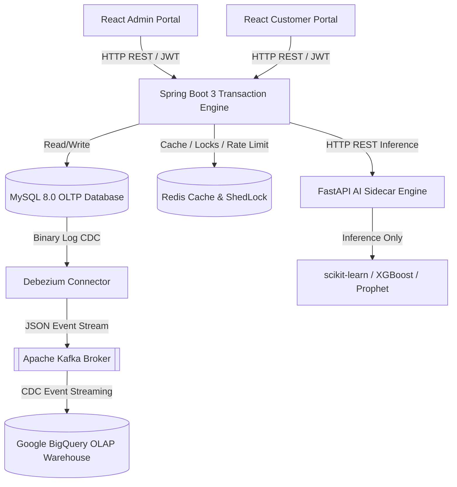
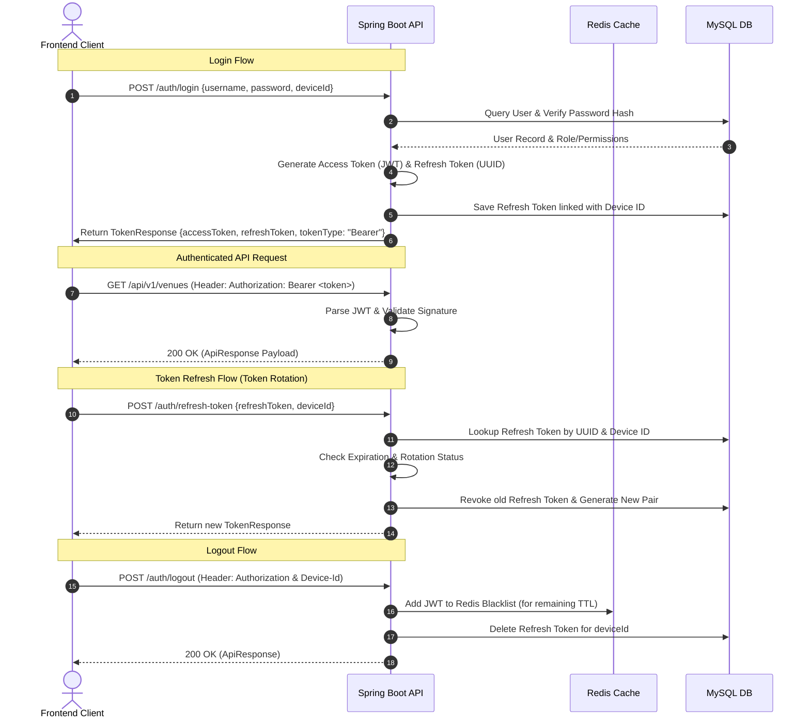

# GateOS API Integration & Backend Contract Specification

This document serves as the official integration contract and reference manual for frontend developers, mobile app developers, and AI agents building interfaces for the GateOS Smart Park management platform. It describes the protocols, validation schemas, status flags, and business policies enforced by the Spring Boot 3 transaction engine and the FastAPI AI inference engine.

---

## 1. Project Overview

GateOS is an enterprise-grade Smart Park (Theme Park) management, Ticketing, and Access Control platform. It leverages transactional database processing (OLTP) for ticketing, real-time access control, and retail services, while utilizing a distributed data warehouse (OLAP) for historical analytics and AI forecasting.

### Architecture Overview



*   **API Version:** `1.0.0`
*   **Base URLs:**
    *   **Local Development:** `http://localhost:8080/api/v1`
    *   **Production Server:** `https://gateos.com/api/v1`
*   **Authentication Strategy:** Stateless JWT Bearer Authentication with sliding session sliding window via Device-linked Refresh Tokens.

---

## 2. Technology Stack

The backend ecosystem comprises the following frameworks and technologies:

*   **Java Platform:** Java 17 LTS.
*   **Core Framework:** Spring Boot 3.3.1.
*   **Security Layer:** Spring Security 6, stateless JWT filter chain, role-based method-level security (`@PreAuthorize`).
*   **JWT Implementation:** `io.jsonwebtoken` (JJWT) `0.12.6` with secure HMAC-SHA512 token signatures.
*   **Relational Database:** MySQL 8.0 containing 43 normalized tables (3NF schema) managed via Flyway migrations.
*   **Caching & Coordination:** Redis 7 (Lettuce client) serving as a rate-limiting bucket backend, a distributed scheduler coordinator (ShedLock), and a JWT blacklist cache.
*   **Event Broker:** Confluent Platform Kafka 7.5.0 and Debezium Connect 2.4 for MySQL CDC data pipeline streams.
*   **Object Storage:** *Not specified in the available backend resources.* (No binary storage configuration found in current Spring Boot profiles).
*   **AI Inference Subsystem:** Python FastAPI microservice providing machine learning predictions using scikit-learn, XGBoost, and Facebook Prophet.
*   **Third-Party Payments:** VNPay (IPN webhook callback) and MoMo QR API integrations.

---

## 3. Authentication Flow

GateOS enforces secure device-bound session authorization. The login and token refresh requests require a `deviceId` parameter to restrict active credentials per client session.

### Core Authentication Actions



1.  **Registration (`POST /auth/register`):** Creates customer profile credentials. Returns the newly created user resource details.
2.  **Login (`POST /auth/login`):** Validates credentials and returns JWT access tokens alongside a device-bound refresh token.
3.  **Logout (`POST /auth/logout`):** Invalidates refresh token, and caches the current access token in the Redis blacklist.
4.  **Refresh Token (`POST /auth/refresh-token`):** Validates current refresh token against the active device registration, revokes the used token, and returns a new rotated token pair.
5.  **Change Password (`POST /auth/change-password`):** Updates user passwords, verifying current values against rules.
6.  **Forgot/Reset Password & Email Verification:** *Not specified in the available backend resources.* (No password recovery endpoints implemented in current backend codebase).

---

## 4. Authorization & Permissions

GateOS implements Role-Based Access Control (RBAC) with fine-grained endpoint authorization checks.

### Active Security Roles
*   `ROLE_ADMIN`: Root administrator with comprehensive CRUD access across all domains, databases, and DLQ systems.
*   `ROLE_STAFF` / `ROLE_NHAN_VIEN`: Park operators and cashiers responsible for onsite ticket sales, ticket validation, and locker allocations.
*   `ROLE_CUSTOMER` / `ROLE_KHÁCH_HÀNG`: System patrons purchasing tickets, booking slots, submitting feedback, and utilizing in-app recommendations.
*   `ROLE_EXECUTIVE` / `ROLE_MANAGER` / `ROLE_ANALYST`: Analytical users restricted to BI reports, business indicators, revenue statistics, and AI forecasting panels.

### Role-Permission Matrix

| Area / Endpoint Pattern | ADMIN | STAFF | CUSTOMER | EXECUTIVE / ANALYST |
| :--- | :---: | :---: | :---: | :---: |
| **Auth APIs** (`/api/v1/auth/**`) | ✓ | ✓ | ✓ | ✓ |
| **User Profiles & Password** | ✓ | ✓ | ✓ | ✓ |
| **Park Management (CRUD)** (`/api/v1/parks/**`) | ✓ | ✗ | ✗ | ✗ |
| **Venues & Attractions (Read)** (`/api/v1/venues/**`) | ✓ | ✓ | ✓ | ✓ |
| **Ticket Reservation & Release** | ✓ | ✓ | ✓ | ✗ |
| **Access Control (Check-In)** (`/api/v1/tickets/check-in/**`) | ✓ | ✓ | ✗ | ✗ |
| **Refund Approvals** (`/api/v1/payments/refunds/**/approve`) | ✓ | ✗ | ✗ | ✗ |
| **BI Reports & Forecasts** (`/api/v1/bi/**`, `/api/v1/dashboard/**`) | ✓ | ✗ | ✗ | ✓ |
| **DLQ Management** (`/api/v1/admin/dlq/**`) | ✓ | ✗ | ✗ | ✗ |
| **Retail Item Stocks** (`/api/v1/retails/**`) | ✓ | ✓ | ✗ | ✗ |

---

## 5. Global API Response Standard

All REST API endpoints (except for the Admin DLQ controller and direct webhook receivers) return a structured wrapper envelope object: `com.smartpark.common.response.ApiResponse<T>`.

### 5.1. Success Response Structure (HTTP 200 / 201)
```json
{
  "status": 200,
  "message": "Operation completed successfully.",
  "data": {
    "id": 1,
    "name": "Đầm Sen Park"
  }
}
```

*   `status` *(Integer)*: Mirrors the HTTP status code (e.g. `200`, `201`).
*   `message` *(String)*: User-friendly feedback message or operation description.
*   `data` *(Object/Array/null)*: The actual response payload matching the requested resource.

### 5.2. Validation Error Response Structure (HTTP 400)
Returned when request parameters or payload fields fail validation constraints.
```json
{
  "status": 400,
  "message": "Validation failed",
  "data": {
    "email": "Email must be a valid email address.",
    "password": "Mật khẩu phải có ít nhất 8 ký tự, bao gồm chữ hoa, chữ thường và số."
  }
}
```

*   `status` *(Integer)*: Enforces `400`.
*   `message` *(String)*: Set to `"Validation failed"`.
*   `data` *(Map<String, String>)*: Dictionary mapping invalid fields to specific constraint violation details.

### 5.3. Business Error Response Structure (HTTP 400 / 409)
Returned when an operation violates business rules.
```json
{
  "status": 400,
  "message": "Mật khẩu hiện tại không đúng.",
  "data": "ERR-AUTH-008"
}
```

*   `status` *(Integer)*: `400` (Bad Request) or `409` (Conflict).
*   `message` *(String)*: Detailed description of the business rule violation.
*   `data` *(String)*: The system-wide Business Error Code (e.g., `ERR-AUTH-008`, `ERR-TKT-001`).

### 5.4. Security Rejection Response Structure (HTTP 401 / 403)
Returned directly by Spring Security when token validation or RBAC permission checks fail. Unlike other endpoints, this follows the `ProblemDetails` standard format:
```json
{
  "type": "https://gateos.com/errors/unauthorized",
  "title": "Unauthorized",
  "status": 401,
  "detail": "Full authentication is required to access this resource",
  "errorCode": "ERR-401-UNAUTHORIZED",
  "timestamp": "2026-07-11T09:04:14Z"
}
```

### 5.5. Server Error Response Structure (HTTP 500)
```json
{
  "status": 500,
  "message": "An unexpected server error occurred.",
  "data": "INTERNAL_SERVER_ERROR"
}
```

---

## 6. Global Business Error Codes

The frontend must intercept these specific business error codes returned in the `data` field of error responses to trigger appropriate user flows.

| Error Code | HTTP Status | Standard Response Message | Meaning & Recommended Frontend Behavior |
| :--- | :---: | :--- | :--- |
| **`ERR-AUTH-001`** | 400 | "Tài khoản đã bị vô hiệu hóa." / "Tài khoản đang bị khóa. Vui lòng thử lại sau." | Account suspended or locked due to brute-force. Block inputs and show a countdown. |
| **`ERR-AUTH-002`** | 400 | "Tên đăng nhập '...' đã tồn tại." | Username collision. Highlight field and prompt user for another input. |
| **`ERR-AUTH-003`** | 400 | "Email '...' đã được sử dụng." | Email collision. Highlight email input and suggest a password reset link. |
| **`ERR-AUTH-004`** | 400 | "Token không phải là refresh token hợp lệ." | Refresh token token type mismatch. Invalidate local session and redirect to Login. |
| **`ERR-AUTH-005`** | 400 | "Refresh token không hợp lệ hoặc đã hết hạn." | Expired session. Invalidate storage credentials and redirect to login page. |
| **`ERR-AUTH-006`** | 400 | "Tài khoản không hoạt động." | Account exists but is not activated. Show verification banner on login. |
| **`ERR-AUTH-007`** | 400 | "Refresh token đã bị thu hồi hoặc không hợp lệ." | Token reused or revoked. Security alert: clear credentials, force login. |
| **`ERR-AUTH-008`** | 400 | "Mật khẩu hiện tại không đúng." | Password update validation failed. Display input error next to current password field. |
| **`ERR-AUTH-009`** | 400 | "Mật khẩu mới phải khác mật khẩu hiện tại." | Password update constraint. Highlight new password field with instructions. |
| **`ERR-TKT-001`** | 400 | "Loại vé này hiện không còn bán." | Inactive ticket type selection. Disable ticket package item, refresh catalogue. |
| **`ERR-TKT-002`** | 409 | "Vé này đã được sử dụng hoặc check-in rồi." | Access Gate scan failure. Display high-visibility red badge warning gate operator. |
| **`ERR-TKT-003`** | 400 | "Vé đã bị hủy/hoàn tiền, không thể sử dụng." | Access Gate scan failure. Display red warning and flag ticket code as invalid. |
| **`ERR-TKT-004`** | 400 | "Vé đã hết hạn." | Ticket validity period has passed. Prompt operator to reject entry. |
| **`ERR-TKT-005`** | 400 | "Vé đã hết hạn. Ngày hợp lệ: [Date]" | Late scan validation. Notify user of validity parameters. |
| **`ERR-TKT-006`** | 400 | "Không thể hoàn hủy vé ở trạng thái '[Status]'." | Invalid ticket state for refund. Disable refund button in user's wallet UI. |
| **`ERR-TKT-010`** | 400 | "Số lượng mua không hợp lệ (1-10 vé)." | Validation check. Lock quantity stepper inputs between 1 and 10 in the cart. |
| **`ERR-TKT-011`** | 409 | "Số lượng vé còn lại không đủ." | Stock depleted. Show warning, refresh available inventory count in UI. |
| **`ERR-TKT-012`** | 400 | "Vé [ID] không ở trạng thái RESERVED." | Concurrency exception during ticket confirmation. Show shopping cart refresh. |
| **`ERR-TKT-013`** | 400 | "Vé chưa được thanh toán." | Check-in scan of unpaid ticket. Reject gate passage, redirect to payment. |
| **`ERR-BOOK-001`** | 409 | "Bạn đang có quá nhiều booking chưa thanh toán." | Limit exceeded. Redirect customer to pending transaction checkout list. |
| **`ERR-BOOK-002`** | 400 | "Không thể xác nhận booking ở trạng thái [Status]." | Invalid booking confirmation flow. Refresh checkout screen. |
| **`ERR-BOOK-004`** | 409 | "Booking đã bị hủy rồi." | Operation on stale booking. Show status badge as cancelled, disable actions. |
| **`ERR-BOOK-005`** | 409 | "Không thể hủy booking đã hoàn thành." | Booking completed. Disable cancellation buttons on detail screen. |
| **`ERR-BOOK-010`** | 409 | "Request trùng lặp (Idempotency check failed)." | X-Idempotency-Key duplicate detection. Block submission and show status. |
| **`ERR-ORD-001`** | 409 | "Chỉ có thể thanh toán đơn hàng PENDING." | Order confirmation mismatch. Hide checkout button on this order. |
| **`ERR-ORD-002`** | 409 | "Đơn hàng này đã bị hủy rồi." | Payment on cancelled order. Display cancellation alert to user. |
| **`ERR-ORD-003`** | 400 | "Đơn hàng đã thanh toán. Vui lòng sử dụng luồng Hoàn tiền (Refund)." | Payment retry. Prompt user to open ticket wallet to view active credentials. |
| **`ERR-PAY-001`** | 409 | "Chỉ có thể thanh toán đơn hàng PENDING." | Payment initialization mismatch. Alert client and refresh order. |
| **`ERR-PAY-002`** | 400 | "Phương thức thanh toán này đang bảo trì." | Payment provider down. Gray out VNPay/MoMo option with alert. |
| **`ERR-PAY-003`** | 400 | "Phương thức thanh toán không được hỗ trợ để tạo URL." | Incorrect configuration. Expose backup cash payment flow to staff. |
| **`ERR-PAY-004`** | 409 | "Chỉ có thể hoàn tiền cho giao dịch SUCCESS." | Refund constraints. Gray out refund request button in transaction list. |
| **`ERR-PAY-005`** | 409 | "Chỉ có thể duyệt hoàn tiền ở trạng thái PENDING." | Admin dashboard action error. Refresh refund table. |
| **`ERR-PROMO-001`** | 409 | "Mã giảm giá không tồn tại." | Promo input error. Display invalid code error in coupon field. |
| **`ERR-PROMO-002`** | 409 | "Chương trình khuyến mãi đã kết thúc hoặc chưa bắt đầu." | Date validation. Highlight coupon input with date range boundaries. |
| **`ERR-PROMO-003`** | 409 | "Mã giảm giá không còn hiệu lực." | Coupon expired or deactivated. Remove discount value from total. |
| **`ERR-PROMO-004`** | 409 | "Mã giảm giá đã hết lượt sử dụng." | Global usage cap reached. Prompt user that code has expired. |
| **`ERR-PROMO-005`** | 409 | "Đơn hàng chưa đạt giá trị tối thiểu để áp dụng mã." | Min-spend logic. Prompt customer showing remaining value needed. |
| **`ERR-PROMO-006`** | 409 | "Bạn đã sử dụng mã giảm giá này rồi." | Single-use coupon constraint. Highlight code as already claimed by user. |
| **`ERR-404-[NAME]`**| 404 | "Không tìm thấy [Resource Name]" | General Resource Not Found. (e.g. `ERR-404-TICKET_TYPE`). Redirect to 404. |

---

## 7. API Overview by Module

### 7.1. Authentication & Security
*   **Business Purpose:** Manage sessions, login credentials, and token rotations.
*   **Endpoints:**
    *   `POST /auth/login` (Public) - Authenticate credentials.
    *   `POST /auth/register` (Public) - Create new customer account.
    *   `POST /auth/refresh-token` (Public) - Rotate access/refresh tokens.
    *   `GET /auth/me` (Authenticated) - Fetch profile payload of current user.
    *   `POST /auth/change-password` (Authenticated) - Update security password.
    *   `POST /auth/logout` (Authenticated) - Revoke active JWT tokens.

### 7.2. Customers & Memberships
*   **Business Purpose:** Manage customer records, membership tiers, loyalty points, and histories.
*   **Endpoints:**
    *   `GET /api/v1/customers` (Admin/Staff) - Paginated customer lists.
    *   `GET /api/v1/customers/{id}` (Admin/Staff) - View specific profile.
    *   `POST /api/v1/customers` (Admin/Staff) - Register new patron manually.
    *   `PUT /api/v1/customers/{id}` (Admin/Staff) - Update personal details.
    *   `DELETE /api/v1/customers/{id}` (Admin) - Soft delete (INACTIVE status).
    *   `GET /api/v1/memberships` (Admin/Staff) - View all loyalty membership accounts.
    *   `GET /api/v1/memberships/{id}` (Admin/Staff/Customer) - View tier/points.
    *   `PATCH /api/v1/memberships/{id}/tier` (Admin) - Manually override tier ID.
    *   `GET /api/v1/memberships/{id}/history` (Admin/Staff/Customer) - Point logs.

### 7.3. Venues, Zones & Attractions
*   **Business Purpose:** CRUD operations on theme parks, structural zones, and ride details.
*   **Endpoints:**
    *   `GET /api/v1/venues` (Public) - Paginated details of theme parks.
    *   `GET /api/v1/venues/{id}` (Public) - Specific park details.
    *   `GET /api/v1/venues/{id}/attractions` (Public) - Attractions in a park.
    *   `GET /api/v1/venues/{id}/ticket-types` (Public) - Ticket catalog in a park.
    *   `GET /api/v1/parks` (Admin) - Configuration lists of parks.
    *   `POST /api/v1/parks` (Admin) - Create new park configurations.
    *   `PUT /api/v1/parks/{id}` (Admin) - Modify park properties.
    *   `DELETE /api/v1/parks/{id}` (Admin) - Soft-delete park.
    *   `GET /api/v1/parks/{parkId}/zones` (Admin) - Zones within a park.
    *   `POST /api/v1/parks/{parkId}/zones` (Admin) - Add zones to a park.

### 7.4. Ride & Maintenance Operations
*   **Business Purpose:** Monitor wait times, record passenger logs, and schedule safety inspections.
*   **Endpoints:**
    *   `GET /api/v1/rides` (Public) - Paginated attractions.
    *   `GET /api/v1/rides/{id}` (Public) - View attraction details.
    *   `POST /api/v1/rides/zones/{zoneId}` (Admin) - Add new ride to a zone.
    *   `PATCH /api/v1/rides/{id}/status` (Admin/Staff) - Update state.
    *   `POST /api/v1/rides/{rideId}/schedules` (Admin/Staff) - Assign staff shift.
    *   `GET /api/v1/rides/{id}/queue` (Public) - Live wait times and waiting count.
    *   `POST /api/v1/rides/{id}/maintenance` (Admin) - Log ride inspection/repairs.
    *   `POST /api/v1/rides/{id}/usage` (Staff) - Track actual passenger counts.

### 7.5. Ticketing & Bookings
*   **Business Purpose:** Lock inventory slots, confirm payments, check-in barcodes, and handle cancellations.
*   **Endpoints:**
    *   `GET /api/v1/tickets` (Admin/Staff) - Paginated audit logs.
    *   `GET /api/v1/tickets/{id}` (Admin/Staff) - Specific ticket record.
    *   `GET /api/v1/tickets/code/{code}` (Admin/Staff) - Search ticket by code.
    *   `POST /api/v1/tickets/reserve` (Admin/Staff) - Hold ticket inventory.
    *   `POST /api/v1/tickets/confirm` (Admin/Staff) - Confirm ticket purchase.
    *   `POST /api/v1/tickets/release` (Admin/Staff) - Release held tickets.
    *   `POST /api/v1/tickets/check-in/{code}` (Admin/Staff) - Scan barcode at gate.
    *   `POST /api/v1/bookings` (Customer/Admin) - Reserve a booking.
    *   `GET /api/v1/bookings` (Admin/Staff) - Query booking records.
    *   `GET /api/v1/bookings/history/{customerId}` (Customer/Admin) - Bookings history.
    *   `GET /api/v1/bookings/{id}` (Customer/Admin) - Booking details.
    *   `GET /api/v1/bookings/code/{code}` (Customer/Admin) - View booking by code.
    *   `POST /api/v1/bookings/{code}/confirm` (Admin/Staff) - Confirm paid booking.
    *   `PUT /api/v1/bookings/{code}/cancel` (Customer/Admin) - Request cancellation.
    *   `PATCH /api/v1/bookings/{id}/status` (Admin) - Update booking status.

### 7.6. Orders & Payments
*   **Business Purpose:** Create orders, generate dynamic payment URLs, process IPNs, and request refunds.
*   **Endpoints:**
    *   `GET /api/v1/orders` (Admin/Staff) - View customer transactions.
    *   `GET /api/v1/orders/{id}` (Admin/Staff/Customer) - View order details.
    *   `GET /api/v1/orders/code/{code}` (Admin/Staff/Customer) - Search order.
    *   `POST /api/v1/orders/code/{code}/confirm-payment` (Admin/Staff) - Mark paid.
    *   `POST /api/v1/orders/code/{code}/cancel` (Admin/Staff/Customer) - Cancel pending order.
    *   `POST /api/v1/payments/create` (Customer/Admin) - Generate VNPay/MoMo gateway link.
    *   `GET /api/v1/payments/vnpay-ipn` (Public Webhook) - VNPay IPN handler.
    *   `POST /api/v1/payments/{paymentId}/refunds` (Customer/Admin) - Request refund.
    *   `POST /api/v1/payments/refunds/{refundId}/approve` (Admin) - Approve refund.

### 7.7. Coupons & Promotions
*   **Business Purpose:** Create discounts, set conditions, and calculate reductions.
*   **Endpoints:**
    *   `GET /api/v1/promotions` (Admin/Staff) - Promotion lists.
    *   `POST /api/v1/promotions` (Admin) - Create promotion.
    *   `GET /api/v1/promotions/coupons` (Admin/Staff) - Active coupons.
    *   `POST /api/v1/promotions/{promotionId}/coupons` (Admin) - Create coupon.
    *   `GET /api/v1/promotions/validate` (Customer/Admin) - Check discount values.

### 7.8. BI, Dashboards & Dead-Letter Queue
*   **Business Purpose:** View financial indicators, historical graphs, and manage Kafka failures.
*   **Endpoints:**
    *   `GET /api/v1/bi/dashboard/summary` (Admin/Analyst) - Daily BI metrics.
    *   `GET /api/v1/bi/revenue/daily` (Admin/Analyst) - Revenue breakdown.
    *   `GET /api/v1/bi/revenue/monthly` (Admin/Analyst) - Monthly revenue breakdown.
    *   `GET /api/v1/bi/revenue/by-ticket-type` (Admin/Analyst) - Revenue by ticket type.
    *   `GET /api/v1/bi/visitors/daily` (Admin/Analyst) - Daily check-in metrics.
    *   `GET /api/v1/bi/operations/peak-hours` (Admin/Analyst) - Hourly check-in metrics.
    *   `GET /api/v1/bi/customers/top-spenders` (Admin/Analyst) - Top customer list.
    *   `GET /api/v1/dashboard/summary` (Admin/Executive) - Operational metrics.
    *   `GET /api/v1/dashboard/revenue` (Admin/Executive) - Aggegated financial flow.
    *   `GET /api/v1/dashboard/visitors/flow` (Admin/Executive) - Hourly check-in flow.
    *   `GET /api/v1/admin/dlq` (Admin only) - View Kafka serialization failures.
    *   `GET /api/v1/admin/dlq/{id}` (Admin only) - View specific DLQ event.
    *   `POST /api/v1/admin/dlq/{id}/requeue` (Admin only) - Requeue message.
    *   `DELETE /api/v1/admin/dlq/{id}` (Admin only) - Delete failed message.

### 7.9. Facilities: Lockers, Parking, F&B, Retail
*   **Business Purpose:** Rent lockers, manage parking fees, and control store inventories.
*   **Endpoints:**
    *   `GET /api/v1/lockers` (Admin/Staff) - View locker statuses.
    *   `POST /api/v1/lockers` (Admin) - Create new physical locker unit.
    *   `GET /api/v1/lockers/transactions` (Admin/Staff) - Locker rental records.
    *   `POST /api/v1/lockers/transactions` (Admin/Staff) - Create rental transaction.
    *   `GET /api/v1/parking/transactions` (Admin/Staff) - Parking rental list.
    *   `POST /api/v1/parking/transactions` (Admin/Staff) - Register vehicle entry/exit.
    *   `GET /api/v1/retails` (Admin/Staff) - Retail shop inventory.
    *   `POST /api/v1/retails` (Admin) - Create retail inventory items.
    *   `PATCH /api/v1/retails/{id}/stock` (Admin/Staff) - Adjust item stock.
    *   `GET /api/v1/foods` (Public) - Active restaurant items.
    *   `GET /api/v1/foods/{id}` (Public) - View specific food item.
    *   `POST /api/v1/foods` (Admin) - Add food item menu.
    *   `DELETE /api/v1/foods/{id}` (Admin) - Soft delete food item.

### 7.10. Feedbacks & Notifications
*   **Business Purpose:** Handle customer reviews and deliver push alert histories.
*   **Endpoints:**
    *   `GET /api/v1/feedbacks` (Admin/Staff) - Customer feedback entries.
    *   `POST /api/v1/feedbacks` (Customer) - Submit a review.
    *   `PATCH /api/v1/feedbacks/{id}/status` (Admin) - Process/Archive feedback.
    *   `GET /api/v1/notifications` (Authenticated) - Active notifications.
    *   `POST /api/v1/notifications` (Admin) - Send notification.

---

## 8. Request & Response Models (Core DTOs)

### 8.1. AuthDto.LoginRequest
*   **JSON Schema:**
    ```json
    {
      "username": "customer_account",
      "password": "SecurePassword123",
      "deviceId": "web-browser-session-id"
    }
    ```
*   **Fields Validation:**
    *   `username` *(String, Required)*: Non-blank.
    *   `password` *(String, Required)*: Non-blank.
    *   `deviceId` *(String, Required)*: Unique client hardware fingerprint.

### 8.2. AuthDto.TokenResponse
*   **JSON Schema:**
    ```json
    {
      "accessToken": "eyJhbGciOiJIUzUxMiJ9...",
      "refreshToken": "7c9f8d9a-1122-3344...",
      "tokenType": "Bearer",
      "userId": 10,
      "username": "customer_account",
      "email": "customer@example.com"
    }
    ```

### 8.3. BookingRequest
*   **JSON Schema:**
    ```json
    {
      "customerId": 10,
      "tickets": [
        {
          "ticketTypeId": 1,
          "quantity": 2
        }
      ],
      "validDate": "2026-07-30",
      "couponCode": "SUMMER50"
    }
    ```
*   **Fields Validation:**
    *   `customerId` *(Long, Required)*: Customer ID.
    *   `tickets` *(List, Required)*: Non-empty.
    *   `tickets[i].ticketTypeId` *(Long, Required)*: Valid Ticket Type ID.
    *   `tickets[i].quantity` *(Integer, Required)*: Between `1` and `10`.
    *   `validDate` *(LocalDate, Required)*: Future date, format `YYYY-MM-DD`.
    *   `couponCode` *(String, Nullable)*: Promo code.

### 8.4. PaymentDto.PaymentRequest
*   **JSON Schema:**
    ```json
    {
      "orderCode": "ORD-123456789",
      "paymentMethodCode": "VNPAY"
    }
    ```
*   **Fields Validation:**
    *   `orderCode` *(String, Required)*: Non-blank.
    *   `paymentMethodCode` *(String, Required)*: Enforced values: `VNPAY`, `MOMO`, `TIEN_MAT`.

---

## 9. Pagination Standard

The API implements Spring Data pagination formatting for collection queries (e.g. GET `/api/v1/venues`).

### Request Parameters
*   `page` *(Integer, Optional)*: 0-indexed page index (default: `0`).
*   `size` *(Integer, Optional)*: Page size (default: `20`).
*   `sort` *(String, Optional)*: Sort key and direction (format: `property,asc|desc`, e.g. `sort=createdAt,desc`).

### Response Structure (Wrapper Envelope)
```json
{
  "status": 200,
  "message": "Operation completed successfully.",
  "data": {
    "content": [
      {
        "id": 1,
        "name": "VIP Pass"
      }
    ],
    "pageable": {
      "pageNumber": 0,
      "pageSize": 20,
      "sort": {
        "empty": false,
        "sorted": true,
        "unsorted": false
      }
    },
    "totalElements": 1,
    "totalPages": 1,
    "last": true,
    "size": 20,
    "number": 0,
    "numberOfElements": 1,
    "first": true,
    "empty": false
  }
}
```

---

## 10. Search & Filter Rules

*   **Searchable Fields:** Search filters are passed as path variables (e.g., `/api/v1/orders/code/{code}`) or query parameters (`/api/v1/venues?status=1`).
*   **Filter Operators:** The backend uses exact matches (`=`) for status codes, dates, and ID keys.
*   **Sorting Parameters:** Sorting is handled via Spring Data's `sort` parameter (e.g., `sort=name,asc`). Multiple sorting criteria can be chained as `sort=role,asc&sort=fullName,desc`.

---

## 11. Core Validation Rules

The backend validation engine enforces the following constraints:

1.  **Email Addresses:** Must conform to RFC 5322 specifications. Checks for structure `^[A-Za-z0-9+_.-]+@(.+)$` are enforced at the DTO layer.
2.  **Passwords:** Checked against `@ValidPassword` validation annotation:
    *   Minimum length of `8` characters.
    *   Must contain at least one uppercase letter (`A-Z`).
    *   Must contain at least one lowercase letter (`a-z`).
    *   Must contain at least one numerical digit (`0-9`).
    *   *Regex:* `^(?=.*[0-9])(?=.*[a-z])(?=.*[A-Z]).{8,}$`
3.  **Phone Numbers:** Max length of `20` characters. Must contain only numeric characters (no spaces or hyphens).
4.  **Quantity Limits:** Restricts the total ticket reservation count per request to a range of `1` to `10`.
5.  **Dates:** Standard `YYYY-MM-DD` ISO formats. Validity dates for bookings must be equal to or greater than today's date (`validDate >= LocalDate.now()`).

---

## 12. Core Business Rules

The backend enforces the following business rules:

1.  **Ticket Reservation & Release:**
    *   Tickets are held in `RESERVED` status.
    *   Reservation instantly decrements available inventory stock counts.
    *   If payment confirmation is not received before session expiration, the tickets are automatically released back to stock (reverting quantities).
2.  **Order Cancellation rules:**
    *   Cancellation requests are only valid for bookings/orders in `PENDING` (unpaid) state.
    *   Once paid (`PAID`/`SUCCESS`), cancellations must go through the formal Refund request approval flow.
3.  **Loyalty Tiers updates:**
    *   Updates occur immediately when a customer's cumulative spend crosses predefined tier thresholds.
    *   Tiers contain multipliers that apply to point calculations for future purchases.
4.  **Check-In Gate validation:**
    *   Tickets must be in `PAID` state.
    *   Scan dates must not exceed the validity date (`LocalDate.now() <= validDate`).
    *   Check-in status updates immediately to prevent double-entry fraud.

---

## 13. Enumerations

### 13.1. TicketStatus
*   `RESERVED`: Held inventory awaiting payment confirmation.
*   `PAID`: Paid ticket, valid for access gate scans.
*   `USED` / `CHECKED_IN`: Scan complete, entry granted.
*   `CANCELLED`: Unpaid reservation cancelled.
*   `REFUNDED`: Formally refunded ticket. Invalid for gate entry.
*   `EXPIRED`: validity date has passed.

### 13.2. BookingStatus
*   `PENDING`: Awaiting payment confirmation.
*   `CONFIRMED`: Paid booking.
*   `CANCELLED`: Reservation terminated.
*   `COMPLETED`: Tickets used or processed.

### 13.3. RideStatus
*   `ACTIVE` / `OPERATIONAL`: Ride is functional.
*   `MAINTENANCE` / `UNDER_MAINTENANCE`: Closed for repairs.
*   `CLOSED`: Off-hours closure.
*   `TEMPORARY_STOP` / `EMERGENCY_STOP`: Blocked for queue control or weather.

### 13.4. MembershipStatus
*   `ACTIVE`: Active account.
*   `EXPIRED`: validity date exceeded.
*   `SUSPENDED`: Suspended account.

---

## 14. File Upload Standard

> [!WARNING]
> **No file upload endpoints are implemented in the current backend source code.**
> File uploads (such as avatars, logo files, or documents) are not supported. The frontend must not implement upload UI elements without coordinating with the backend team.

---

## 15. Date & Time Standard

*   **Time Zone:** Universal Time Coordinated (`UTC`).
*   **Response Format (DateTime):** ISO 8601 string format `YYYY-MM-DDTHH:mm:ssZ` (e.g. `2026-07-11T09:04:14Z`).
*   **Response Format (Date):** ISO 8601 string format `YYYY-MM-DD` (e.g. `2026-07-30`).
*   **Local Time Representation:** The frontend must convert UTC times to the client's local zone (typically `Asia/Ho_Chi_Minh`, UTC+7) for presentation.

---

## 16. Security Considerations

### 16.1. Token Lifetimes
*   **Access Token (JWT):** Short-lived (e.g., 15 minutes) for security.
*   **Refresh Token:** Long-lived (e.g., 7 days) and bound to a specific `deviceId`.

### 16.2. Token Refresh Handling (Rotation)
When a refresh token is used to request a new access token, the backend invalidates the old refresh token and issues a new one. The frontend must save this new rotated refresh token immediately.

### 16.3. CORS Policy
Allowed origins are configured in the backend configuration:
*   **Allowed Origins:** `http://localhost:3000` (custom portals).
*   **Allowed Credentials:** Enabled (`true`).
*   **Allowed Headers:** All (`*`).
*   **Allowed Methods:** `GET`, `POST`, `PUT`, `DELETE`, `PATCH`, `OPTIONS`.

### 16.4. CSRF
Disabled on the REST API layers, as state is maintained using stateless JWT headers.

### 16.5. Rate Limiting
Rate limiting is enforced at the API Gateway or controller level using Bucket4j backed by Redis. When limits are exceeded, the API returns:
*   **HTTP Status:** `429 Too Many Requests`

---

## 17. Frontend Integration Notes

1.  **Axios / Fetch Interceptor Setup:**
    *   The frontend must implement a request interceptor to attach the JWT token in the `Authorization: Bearer <token>` header.
    *   A response interceptor must handle `401 Unauthorized` errors. When a `401` occurs, the client should attempt a token refresh call. If the refresh call fails, clear the session and redirect the user to the login screen.
2.  **Idempotency Keys:**
    *   For write actions (such as booking ticket reservations via `POST /api/v1/bookings`), the frontend must include a unique UUID in the header:
        *   **Header Name:** `X-Idempotency-Key`
    *   This prevents double submissions from network retries.
3.  **Loading Skeletons:**
    *   Display loading skeletons for paginated tables and dashboard panels (using Material-UI's `<Skeleton />`) to handle API latencies.

---

## 18. Recommended Frontend Architecture

### Feature-Based Folder Structure
The frontend application (React, Vite, Redux Toolkit, RTK Query) should be organized by feature modules to align with the backend's domain-driven structure:

```
src/
├── assets/                  # Static assets (images, icons)
├── components/              # Shared UI components (Buttons, Inputs, Modals)
├── core/                    # Core configuration and services
│   ├── store/               # Redux Store configuration
│   └── services/            # Base RTK Query / Axios configurations
├── features/                # Domain-specific modules
│   ├── auth/                # Login, registration, token refresh slices & services
│   ├── bookings/            # Ticket purchase, history slices, checkout UI
│   ├── tickets/             # QR ticket wallet, scan verification UI
│   ├── dashboard/           # ECharts analytics, BI summaries, metrics panel
│   └── venues/              # Interactive park maps, attractions, wait times
├── layouts/                 # Page Layouts (Admin Dashboard Layout, Customer Layout)
└── routes/                  # Route configurations and ProtectedRoutes
```

*   **State Management:** Redux Toolkit (RTK) with RTK Query services to manage API request states, caching, and cache invalidation tags.

---

## 19. Integration Checklist

Before deploying the frontend application, verify that all integration requirements are met:

*   [ ] **JWT Attachment:** Token is attached in the `Authorization: Bearer <token>` header for all protected requests.
*   [ ] **Token Refresh Handling:** Interceptor handles `401 Unauthorized` responses and silently refreshes the access token using the rotated refresh token.
*   [ ] **deviceId Transmission:** `deviceId` parameter is saved in localStorage and sent in both login and token refresh requests.
*   [ ] **Validations match:** Form validation rules match the backend's validation constraints (e.g. password rules).
*   [ ] **Idempotency Keys:** `X-Idempotency-Key` headers are attached to all booking creation requests.
*   [ ] **Date Standard:** All request/response dates use the ISO-8601 UTC date-time standard.
*   [ ] **Business Errors:** The UI intercepts business error codes (e.g. `ERR-TKT-002`) and displays descriptive error panels.
*   [ ] **CORS Settings:** Frontend origin matches the backend's allowed origins (`http://localhost:3000`).
